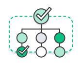
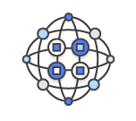

# DevOps

## **목차**
- [1. DevOps 정의](#1)
- [2. DevOps 작동 방식](#2)
- [3. DevOps의 이점](#3)
- [4. DevOps의 중요성](#4)
- [5. DevOps 모델을 도입하는 방법](#5)
- [6. DevOps 방식](#6)
- [7. Silo 현상](#silo)

## 1. DevOps 정의  
> DevOps는 애플리케이션과 서비스를 빠른 속도로 제공할 수 있도록 조직의 역량을 향상시키는 문화, 철학, 방식 및 도구의 조합이다. 기존의 소프트웨어 개발 및 인프라 관리 프로세스를 사용하는 조직보다 제품을 더 빠르게 혁신하고 개선할 수 있다. 이러한 빠른 속도를 통해 조직은 고객을 더 잘 지원하고 시장에서 좀 더 효과적으로 경쟁할 수 있다.  

 
 

## 2. DevOps 작동방식  
> DevOps 모델에서는 개발팀과 운영팀이 더 이상 ["사일로"](#silo)에 묶여 있지 않다. 이 두 팀이 단일팀으로 병합되어 엔지니어가 개발에서 테스트, 배포, 운영에 이르기까지 전체 애플리케이션 수명 주기에 걸쳐 작업하고 단일 기능에 한정되지 않은 광범위한 기술을 개발한다.  

일부 DevOps 모델에서 품질 보증팀과 보안팀 또한 애플리케이션 수명 주기에 걸쳐 개발 및 운영과 좀 더 긴밀하게 통합된다. DevOps 팀 전체가 보안을 중점으로 두는 경우 때때로 DevSecOps라고 불린다.

이러한 팀에서는 DevOps 방식을 사용하여 속도가 느리고 `수동으로 수행되던 프로세스를 자동화`한다. 또한, 애플리케이션을 안정적으로 빠르게 운영하고 개선하는 데 도움이 되는 기술 스택과 도구를 사용한다. 이러한 도구 덕분에 엔지니어는 이전 같았으면 다른 팀의 도움이 필요했을 때 코드 배포 또는 인프라 프로비저닝과 같이 작업을 독립적으로 수행할 수 있으며, 따라서 팀의 작업 속도가 더욱 향상된다.

 

## 3. DevOps의 이점

    <h3>속도</h3>
    작업 속도가 빨라지므로 고객을 위해 더 빠르게 혁신하고, 시장 변화에 더 잘 적응하고, 좀 더 효율적으로 비즈니스 성과를 창출할 수 있다. DevOps 모델을 사용하면 개발자와 운영팀이 이러한 성과를 실현할 수 있다. 예를 들어 마이크로 서비스와 지속적 전달을 사용하면 팀에서 서비스를 주도적으로 운영하여 업데이트를 좀 더 빠르게 릴리스할 수 있다.

    <h3>신속한 제공</h3>
    릴리스의 빈도와 속도를 개선하여 제품을 더 빠르게 혁신하고 개선할 수 있다. 새로운 기능의 릴리스와 버그 수정 속도가 빨라질수록 고객의 요구에 더 빠르게 대응하여 경쟁 우위를 강화할 수 있다. `지속적 통합`과 `지속적 전달`은 빌드에서 배포까지 소프트웨어 릴리스 프로세스를 자동화하는 방식이다.

    <h3>안정성</h3>
    최종 사용자에게 지속적으로 긍정적인 경험을 제공하는 한편 더욱 빠르게 안정적으로 제공할 수 있도록 애플리케이션 업데이트와 인프라 변경의 품질을 보장한다. `지속적 통합`및 `지속적 전달`과 같은 방식을 사용하여 각 변경 사항이 제대로 작동하며 안전한지 테스트한다. `모니터링과 로깅` 방식을 통해 실시간으로 성능에 대한 정보를 얻을 수 있다.

    <h3>확장</h3>
    규모에 따라 인프라와 개발 프로세스를 운영 및 관리한다. 자동화와 일관성이 지원되므로 위험을 줄이면서 복잡한 시스템 또는 변화하는 시스템을 효율적으로 관리할 수 있다. 예를 들어 `코드형 인프라`를 사용하면 개발, 테스트 및 프로덕션 환경을 반복 가능하고 좀 더 효율적인 방식으로 관리할 수 있다.

    <h3>협업 강화</h3>
    주인의식 및 책임과 같은 가치를 강조하는 DevOps 문화 모델에서 좀 더 효과적인 팀을 구축한다. 개발자와 운영팀은 긴밀하게 협력하고, 많은 책임을 공유하며, 워크플로를 결합한다. 이를 통해 비효율성을 줄이고 시간을 절약한다.(예: 개발자와 운영팀 간의 인도 기간 단축, 실행되는 환경을 고려한 코드 작성 등).

    <h3>보안</h3>
    제어를 유지하고 규정을 준수하면서 진행할 수 있다. 자동화된 규정 준수 정책, 세분화된 제어 및 관리 기술을 사용함으로써 보안을 그대로 유지하면서 DevOps 모델을 도입할 수 있다. 예를 들어 코드형 인프라와 코드형 정책을 사용하면 규모에 따라 규정 준수를 정의하고 추적할 수 있다.

 

## 4. DevOps의 중요성
소프트웨어와 인터넷은 쇼핑에서 엔터테인먼트 그리고 뱅킹에 이르기까지 전 세계와 산업을 변화시켰다.

이제 소프트웨어는 비즈니스를 지원하는 것에 그치지 않고, 비즈니스의 모든 부분에서 핵심적인 구성 요소가 되었다.

기업은 온라인 서비스 또는 애플리케이션으로 제공되는 소프트웨어를 통해 온갖 종류의 디바이스에서 고객과 상호 작용한다.

또한, 소프트웨어를 사용하여 물류, 통신, 운영 등과 같은 가치 체인의 모든 부분을 혁신함으로써 운영 효율성을 향상한다.

20세기에 실제 상품을 제조하는 기업이 산업 자동화를 통해 제품의 설계, 생산 및 전달 방법을 혁신한 것과 마찬가지로, 오늘날의 기업은 소프트웨어를 구축하고 제공하는 방법을 혁신해야 한다.

 

## 5. DevOps 모델을 도입하는 방법
> ## DevOps 문화 철학  

DevOps로 전환하기 위해서는 문화와 사고방식의 변화가 필요하다.

간단하게 말하자면 DevOps는 기존에 `사일로에 묶여 있던 개발과 운영이라는 두 팀 간의 장벽을 없애준다.`

일부 조직에서는 개발팀과 운영팀이 나뉘어 있지 않고 엔지니어가 두 업무를 모두 수행할 수도 있다.

DevOps에서는 두 팀이 함께 작업하여 `개발자의 생산성과 운영의 안정성을 모두 최적화`한다.
    
두 팀은 자주 소통하고, 효율성을 높이고, 고객에게 제공하는 서비스의 품질을 향상하기 위해 최선을 다한다.
    
최종 고객의 요구와 자신이 어떻게 이러한 요구를 해결하는 데 공헌할 수 있는지 생각함으로써 일반적으로 명시된 역할 또는 직책의 범위를 넘어 서비스에 대한 완전한 주인의식을 갖는다.
    
품질 보증팀 및 보안팀도 이 두팀과 긴밀하게 통합될 수 있다.

> ## DevOps 방식 설명

조직이 소프트웨어 개발과 인프라 관리 프로세스의 자동화 및 간소화를 통해 더 빠르게 혁실할 수 있도록 지원하는 몇 가지 주요 방식이 있다.

이러한 방식 대부분은 적절한 도구를 사용해 수행된다.

기본 방식 중 하나는 `소규모 업데이트를 자주 수행하는 것`이다.

이 방식을 통해 조직은 고객을 위해 더 빠르게 혁신할 수 있다. 이러한 업데이트는 기존 릴리스 방식에서 수행되는 `낮은 빈도의 업데이트보다 일반적으로 좀 더 증분적인 특성`을 갖는다.

소규모로 자주 업데이트하면 각 배포의 위험이 줄어든다. 팀에서 오류의 원인이 되는 최근 배포를 확인할 수 있으므로 더 빠르게 버그를 해결할 수 있다.

업데이트 소요 시간과 규모는 다르지만, DevOps 모델을 사용하는 조직은 기존 소프트웨어 개발 방식을 사용하는 조직보다 훨씬 더 자주 업데이트를 배포한다.

또한, 조직은 `마이크로 서비스 아키텍처를 사용하여 애플리케이션의 유연성과 혁신의 속도를 높일 수 있다`.

마이크로 서비스 아키텍처는 복잡한 대규모 시스템을 간단하고 독립적인 프로젝트로 결합 해제한다.

애플리케이션은 많은 개별 구성 요소(서비스)로 분할되며, 각 서비스는 단일 목적 또는 기능으로 한정되고 피어 서비스 및 전체 애플리케이션과는 별개로 운영된다.

이 아키텍처는 `애플리케이션 업데이트를 위한 조정 오버헤드를 줄이고, 각 서비스가 이를 담당하는 작고 민첩한 팀과 연결되면 조직이 좀 더 신속하게 움직일 수 있다.`

하지만 마이크로 서비스와 릴리스 빈도 증가의 조합은 배포 수를 현저히 늘려 운영 문제로 이어질 수 있다. 따라서 지속적 통합 및 지속적 전달과 같은 DevOps 방식을 사용하면, 이러한 문제를 해결하고 조직이 안전하고 안정적인 방식으로 신속하게 업데이트를 제공할 수 있다.

코드형 인프라 및 구성 관리와 같은 인프라 자동화 방식은 잦은 변경에 대해 컴퓨팅 리소스를 탄력적이고 대응적으로 유지하는 데 도움이 된다.

또한 모니터링과 로깅의 사용도 엔지니어가 애플리케이션 및 인프라의 성능을 추적하여 문제에 신속하게 대응할 수 있게 하는 데 도움이 된다.

 

## 6. DevOps 방식

    

    <h3>지속적 통합</h3>
    지속적 통합은 자동화된 빌드 및 테스트가 수행된 후, 개발자가 코드 변경 사항을 중앙 리포지토리에 정기적으로 병합하는 소프트웨어 개발 방식이다. 지속적 통합의 핵심 목표는 버그를 신속하게 찾아 해결하고, 소프트웨어 품질을 개선하고, 새로운 소프트웨어 업데이트를 검증 및 릴리스하는 데 걸리는 시간을 단축하는 것이다.

    

    <h3>지속적 전달</h3>
    지속적 전달은 프로덕션에 릴리스하기 위한 코드 변경이 자동으로 빌드, 테스트 및 준비되는 소프트웨어 개발 방식이다. 빌드 단계 이후의 모든 코드 변경 사항을 테스트 환경 및/또는 프로덕션 환경에 배포함으로써 지속적 통합을 확장한다. 지속적 전달이 적절하게 구현되면, 개발자는 언제나 즉시 배포할 수 있고 표준화된 테스트 프로세스를 통화한 빌드 아티팩트를 보유하게 된다.

    

    <h3>마이크로 서비스</h3>
    마이크로 서비스 아키텍처는 단일 애플리케이션을 작은 서비스의 집합으로 구축하는 설계 접근 방식이다. 각 서비스는 자체 프로세스에서 실행되고, 주로 HTTP 기반 API(Application Programming Interface)라는 간편한 매커니즘을 사용하는 잘 정의된 인터페이스를 통해 다른 서비스와 통신한다. 마이크로 서비스는 비즈니스 기능을 중심으로 구축되며, 각 서비스는 단일 목적으로 한정되어 있다. 다양한 프레임워크 또는 프로그래밍 언어를 사용하여 마이크로 서비스를 작성하고, 이를 독립적으로 단일 서비스 또는 서비스 그룹으로 배포할 수 있다.

    

    <h3>코드형 인프라</h3>

코드형 인프라는 버전 관리 및 지속적 통합과 같은 코드와 소프트웨어 개발 기술을 사용하여 인프라를 프로비저닝하고 관리하는 방식이다. 클라우드의 API 중심 모델을 사용하면 개발자와 시스템 관리자가 수동으로 리소스를 설정 및 구성할 필요 없이 프로그래밍 방식으로 대규모로 인프라와 상호 작용할 수 있다. 따라서 엔지니어는 코드 기반 도구를 사용하여 인프라와 인터페이스하고, 애플리케이션 코드를 다루는 방법과 유사한 방식으로 인프라를 다룰 수 있다. 인프라가 코드를 통해 정의되므로 인프라와 서버를 표준화된 패턴을 사용하여 배포하고, 최신 패치와 버전으로 업데이트하거나, 반복 가능한 방식으로 복제할 수 있다.

**구성관리**  
개발자와 시스템 관리자는 코드를 사용하여 운영 체제를 자동화하고 구성, 운영 작업 등을 호스팅한다. 코드를 사용함으로써 구성 변경을 반복하고 표준화할 수 있다. 따라서 개발자와 시스템 관리자는 운영 체제, 시스템 애플리케이션 또는 서버 소프트웨어를 수동으로 구성할 필요가 없다.

**코드형 정책**  
인프라와 인프라의 구성이 클라우드로 체계화된 조직은 규정 준수를 규모에 따라 동적으로 모니터링하고 적용할 수 있다. 따라서 코드를 통해 설명된 인프라는 자동화된 방식으로 추적, 검증 및 재구성할 수 있다. 이는 조직이 손쉽게 리소스 변경을 관리하고 보안 조치가 분산 방식으로 적절하게 적용될 수 있게 해준다.(예: PCI_DSS 또는 HIPAA 규정 준수나 정보 보안) 규정 위반 리소스가 추가 조사를 할 수 있도록 자동으로 플래그가 지정되거나 규정 준수 상태로 자동으로 변경될 수 있으므로 이를 통해 조직 내 팀은 더 빠르게 움직일 수 있다.

    

    <h3>모니터링 및 로깅</h3>
조직은 지표와 로그를 모니터링하여 애플리케이션 및 인프라 성능이 제품의 최종 사용자 경험에 어떤 영향을 미치는지 확인한다. 조직은 애플리케이션과 인프라에서 생성되는 데이터 및 로그를 캡처하고 분류한 다음 이를 분석함으로써 변경 또는 업데이트가 사용자에게 어떤 영향을 주는지 이해하고, 문제의 근본 원인 또한 예상치 못한 변경에 대한 통찰력을 확보한다. 서비스는 연중무휴 24시간 사용할 수 있어야하고 애플리케이션 및 인프라 업데이트 빈도가 증가함에 따라 적극적인 모니터링이 점점 더 중요해지고 있다. 이러한 데이터에 대한 실시간 분석을 수행하거나 알림을 생성하는 것도 조직이 좀 더 능동적으로 서비스를 모니터링하는 데 도움이 된다.

    

    <h3>커뮤니케이션 및 협업</h3>
조직에서 커뮤니케이션과 협업이 증가하는 것도 DevOps의 주요 문화적 측면 중 하나이다. DevOps 도구 및 소프트웨어 제공 프로세스 자동화를 사용하면 개발 및 운영의 워크플로와 책임을 물리적으로 합침으로써 협업이 이루어진다. 해당 팀에서는 이 위에 채팅 애플리케이션, 문제 또는 프로젝트 추적 시스템, wiki를 사용하여 커뮤니케이션을 지원하고 정보를 공유하는 강력한 문화적 표준을 확립한다. 이를 통해 개발자와 운영 그리고 마케팅이나 영업과 같은 다른 팀 간에도 커뮤니케이션이 활발해지면서 조직의 모든 부분에서 목표와 프로젝트에 좀 더 가깝게 다가갈 수 있다.

 

## 7. Silo 현상
부서 또는 조직단위로 업무 효율화 측면에서 IT 인프라 및 자체 솔루션을 구축해서 사용하다보면 각 부서, 사업단위나, 브랜치별로 데이터가 일치하지 않는 증상이 있는데 이를 사일로(Silo)현상, 사일로화 된다라고 이야기한다.  

이렇게 되면 부서/조긱간 표준화가 어렵고 비즈니스 환경변화에 유연한 대처가 어려운 대처가 어려운 상황에 처해질 우려가 있는데, 이렇게 복잡하게 얽혀있는 문제들을 해결하기 위해 최근 깅버들은 다방면으로 노력하고 있다.

간단한 예로, 시스템 부분의 경우 SOA(Service Oriented Architecture), 가상화(Virtualization), 클라우드 등의 형태로 통합하고 애플리케이션의 데이터가 보다 양질의 결과를 얻어낼 수 있도록 하여 사일로 현상을 해결하려고 한다.

 

> 출처 및 참고 : https://aws.amazon.com/ko/devops/what-is-devops/