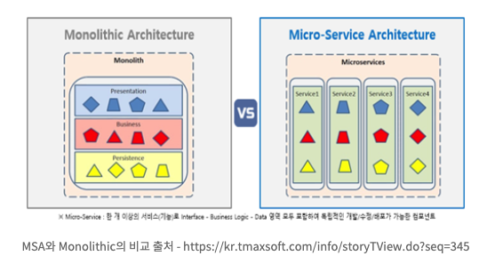
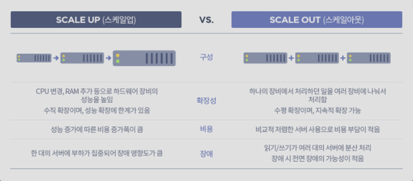

# MSA(MicroService Architecture)

## **목차**
- [1. MSA 란?](#1)
- [2. MSA 등장배경](#2)
- [3. MSA의 정의](#3)
- [4. MSA의 특징](#4)
- [5. MSA의 장점](#5)
- [6. MSA의 단점](#6)
- [7. 용어정리](#7)

## 1. MSA(MicroService Architecture) 란?
> 마이크로서비스 아키텍처에 대한 정확한 정의는 없다. 하지만 마이크로 서비스란 작고, 독립적으로 배포 가능한 각각의 기능을 수행하는 서비스로 구성된 프레임워크라고 할 수 있다. 마이크로서비스는 완전히 독립적으로 배포가 가능하고, 다른 기술 스택(개발 언어, 데이터베이스 등)이 사용 가능한 단일 사업 영역에 초점을 둔다.  

> "하나의 큰 어플리케이션을 여러개의 작은 어플리케이션으로 쪼개어 변경과 조합이 가능하도록 만든 아키텍처

 

## 2. MSA의 등장배경

`Monolithic Architecture`는 소프트웨어의 모든 구성요소가 한 프로젝트에 통합되어 있는 형태이다. 웹 개발을 예로 들면 웹 프로그램을 개발하기 위해 모듈별로 개발을 하고, 개발이 완료된 웹 어플리케이션을 하나의 결과물로 패키징하여 배포되는 형태를 말한다.

이런 어플리케이션을 모놀리식 어플리케이션이라 하며, 웹의 경우 WAR파일로 빌드되어 WAS에 배포하는 형태를 말한다. 주로 소규모 프로젝트에서 사용된다.

하지만 일정 규모 이상의 서비스, 혹은 수백명 이상의 개발자가 투입되는 프로젝트에서 Monolithic Architecture는 한계를 보인다.

- **부분 장애가 전체 서비스의 장애로 확대될 수 있다.**
    - 개발자의 잘못된 코드 배포 또는 갑작스런 트래픽 증가로 인해 성능에 문제가 생겼을 때, 서비스 전체의 장애로 확대될 수 있다.

- **부분적인 *Scale-out(여러 server로 나누어 일을 처리하는 방식)이 어렵다.**
    - Monolithic Architecture에서는 사용되지 않는 다른 모든 서비스가 Scale-out되어야 하기 때문에 부분 Scale-out이 어렵다.

- **서비스의 변경이 어렵고, 수정 시 장애의 영향도 파악이 힘들다.**
    - 여러 컴포넌트가 하나의 서비스에 강하게 결합되어 있기 때문에 수정에 대한 영향도 파악이 힘들다.

- **배포 시간이 오래 걸린다.**
    - 최근 어플리케이션 개발 방법은 CI/CD를 통한 개발부터 배포까지 빠르게 반영하는 추세이다. 그러나 규모가 점점 커짐에 따라 작은 변경에도 높은 수준의 테스트 비용이 발생하기도 하며, 많은 사람이 하나의 시스템을 개발하여 배포하기 때문에 영향을 줄 수 밖에 없다.

- **한 Framework와 언어에 종속적이다.**
    - Spring framework를 사용할 경우, blockchain 연동 모듈을 추가할 때 node.js를 사용하는 것이 일반적이며 강세이다. 그러나 java를 이용하여 해당 모듈을 작성할 수 밖에 없다. 선정했던 framework가 Spring이기 때문이다.

이러한 Monolithic Architecture의 문제점들을 보완하기 위해 `MSA`가 등장하게 되었다. 기존의 특정한 물리적인 서버에 서비스를 올리던 on-promis 서버 기반의 Monolithic Architecture에서 이제는 클라우드 환경을 이용하여 서버를 구성하는 MicroService Architecture로 많은 서비스들이 전환되고 있다.

 
 

## 3. MSA의 정의  
Martin Folwer는 MSA에 대해 아래와 같이 설명하였다.  
  
***"the microservice architectural style is an approach to developing a single application as a suite of small services, each running in its own process and communicating with lightweight mechanisms, often an HTTP resource API. These services are built around business capabilities and independently deployable by fully automated deployment machinery."***   

참조 : https://martinfowler.com/articles/microservices.html

위 문장에서 가장 핵심적인 문구는 `small services, each running in its own process(스스로 돌아 갈 수 있는 작은 서비스`와 `independently deployable(독립적 배포 가능)`이다. MicroService를 가장 잘 설명해 줄 수 있는 문구이다.

MicroService Architecture의 정의는 아래와 같다.

- 각각의 서비스는 그 크기가 작을 뿐, 서비스 자체는 하나의 Monolithic Architecture와 유사한 구조를 가진다.
- 각각의 서비스는 독립적으로 배포가 가능해야한다.
- 각각의 서비스는 다른 서비스에 대한 의존성이 최소화 되어야 한다.
- 각 서비스는 개별 프로세스로 구동되며, REST와 같은 가벼운 방식으로 통신 되어야 한다.

 
 

## 4. MSA의 특징
- MSA는 API를 통해서만 상호작용할 수 있다. 즉, 마이크로 서비스는 서비스의 end-point(접근점)을 API 형태로 외부에 노출하고, 실질적인 세부 사항은 모두 추상화한다. 내부의 구현로직, 아키텍처와 프로그래밍 언어, 데이터베이스, 품질 유지 체계와 같은 기술적인 사항들은 서비스 API에 의해 철저하게 가려진다.

    따라서 ***SOA(Service Oriented Architecture)**의 특징으로 다수 공통으로 가진다.

- 제대로 설계 된 마이크로서비스는 하나의 비즈니스 범위에 맞춰 만들어지므로 하나의 기능만 수행한다. 즉, 어플리케이션 출시처럼 하나의 목표를 향해 일하지만 자기가 개발하는 서비스만 책임진다. 그리고 여러 어플리케이션에서 재사용할 수 있어야 한다.

- 어플리케이션은 항상 기술 중립적 프로토콜을 사용해 통신하므로 서비스 구현 기술과는 무관하다. 따라서 마이크로서비스 기반의 어플리케이션을 다양한 언어와 기술로 구축할 수 있다는 것을 의미한다.

- 마이크로서비스는 SOA에서 사용되는 집중화된 관리 체계를 사용하지 않는다. 마이크로서비스 구현체의 공통적인 특징중 하나는 ESB(Enterprise Service Bus)와 같은 무거운 제품에 의존하지 않는다는 점이다. REST등 가벼운 통신 아키텍처, 또는 Kafka 등을 이용한 message stream을 주로 사용한다.

 
 

## 5. MSA의 장점
- 배포(deployment) 관점
    - 서비스 별 개별 배포 가능 (배포 시 전체 서비스의 중단이 없다)
        - 요구사항을 신속하게 반영하여 빠르게 배포할 수 있다.

- 확장(scaling) 관점
    - 특정 서비스에 대한 확장성이 용이함
        - 클라우드 사용에 적합한 아키텍처

- 장애(failure) 관점
    - 장애가 전체 서비스로 확장될 가능성이 적음
        - 부분적 장애에 대한 격리가 수월함

이외에도, 신기술의 적용이 유연하고, 서비스를 polyglot하게 개발/운영 할 수 있다는 장점이 있다.

 
 

## 6. MSA의 단점

> Monolithic Architecture은 단순하나 아키텍쳐인데 비해 MSA는 보다 복잡한 아키텍쳐로, 전체 서비스가 커짐에 따라 그 복잡도가 기하급수적으로 늘어날 수 있다.

- 성능 - 서비스간 호출 시 API를 사용하기 때문에, 통신 비용이나 Latency가 그만큼 늘어나게 된다.

- 테스트 / 트랜잭션 - 서비스가 분리되어 있기 때문에 테스트와 트랜잭션의 복잡도가 증가하고, 많은 자원을 필요로 한다.

- 데이터 관리 - 데이터가 여러 서비스에 걸쳐 분산되기 때문에 한번에 조회하기 어렵고, 데이터의 정합성 또한 관리하기 어렵다.

 
 

## 7. 용어정리 
- SOA(Service Oriented Architecture)
    - 대규모 컴퓨터 시스템을 구축할 때의 개념으로, 업무상 일 처리에 해당하는 소프트웨어 기능을 서비스로 판단하고, 그 서비스를 네트워크상에서 연동하여 시스템 전체를 구축해가는 방법론이다.
    - 업무 처리 변화를 시스템에 빠르게 반영하고자하는 수요에 대응하기 위해 2004년 부터 IT업계에서 주목하고 있다.
    - 플랫폼에 종속되지 않는 표준 인터페이스를 통해 기업의 업무를 표현한 '느슨하게 연결되고(Loosly coupled) 상호 조합 가능한 소프트웨어'이다.
    - SOA에서는 각각의 서비스가 데이터 계층, 비즈니스 로직, 뷰에 대한 모듈을 모두 가지고 있고, 각 서비스 간의 의존성이 최소화된다.
    - SOA 시스템의 규모가 증가함에 따라 서비스의 중복이 발생할 수 있고, 이를 방지하기 위해 이미 구현된 서비스가 있는지를 검색할 수 있어야 한다.

- 스케일 아웃(Scale-out)  
    - 장비를 추가해서 확장하는 방식을 말한다.  
    - 기존 서버만으로 용량이나 성능의 한계에 도달했을 때, 비슷한 사양의 서버를 추가로 연결해 처리할 수 있는 데이터 용량이 증가할 뿐만  아니라 기존 서버의 부하를 분담해 성능 향상의 효과를 기대할 수 있다.
    - 서버를 추가로 확장하기 때문에 `수평 스케일링(horizontal scaling)`이라고도 불린다.

- 스케일 업(Scale-up)
    - 기존의 서버를 보다 높은 사양으로 업그레이드 하는 것을 말한다.
    - 성능이나 용량 증강을 목적으로 하나의 서버에 디스크를 추가하거나 CPU나 메모리를 업그레이드 시키는 것을 말한다.
    - 하나의 서버의 능력을 증강하기 때문에 `수직 스케일링(vertical scaling)`이라고도 한다.

- **스케일 업(Scale-up)과 스케일 아웃(Scale-out)의 장단점**  
    
    

 
 

> 출처 및 참고  
    - 1. https://wooaoe.tistory.com/57  
    - 2. https://velog.io/@tedigom/MSA-%EC%A0%9C%EB%8C%80%EB%A1%9C-%EC%9D%B4%ED%95%B4%ED%95%98%EA%B8%B0-1-MSA%EC%9D%98-%EA%B8%B0%EB%B3%B8-%EA%B0%9C%EB%85%90-3sk28yrv0e
