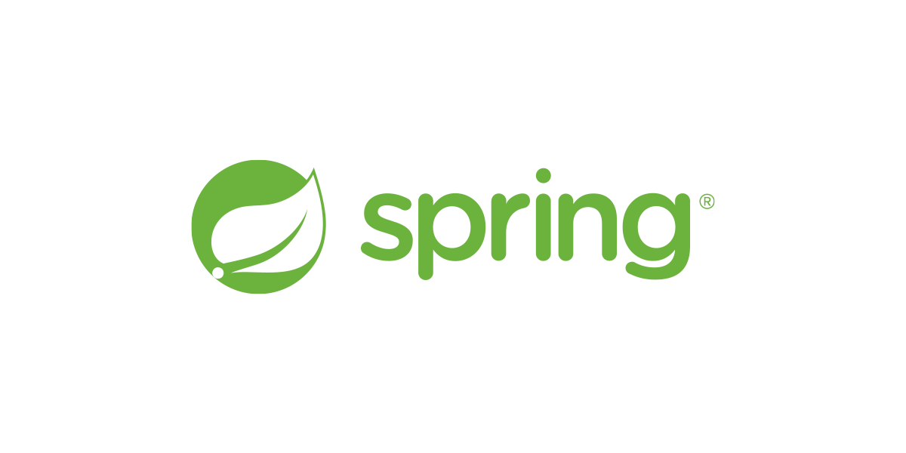

# Spring과 Spring Boot 차이

## **목차**
- [1. Spring Framework](#1)
- [2. Spring Boot](#2)
- [3. 차이점](#3)
- [4. Spring Boot starter란](#4)

## Spring Framework 
스프링 프레임워크(Spring Framework)는 자바 플랫폼을 위한 오픈소스 애플리케이션 프레임워크로서 간단히 스프링(Spring)이라고도 불린다. 동적인 웹 사이트를 개발하기 위한 여러가지 서비스를 제공하고 있다. 대한민국 공공기관의 웹 서비스 개발 시 사용을 권장하고 있는 전자정부 표준프레임워크의 기반 기술로서 쓰이고 있다.

### 장점
> 경량 컨테이너  
> IoC(Invertion of Control : 제어 역행)  
> Di(Dependency Injection : 의존성 주입)  
> AOP(Aspect-Oriented Programming : 관점지향 프로그래밍 )

 

## Spring Boot? 
스프링 프레임워크는 기능이 많은만큼 환경설정이 복잡한 편이다. 이에 어려움을 느끼는 사용자들을 위해 나온 것이 바로 스프링 부트이다. 스프링부트는 스프링 프레임워크를 사용하기 위한 설정의 많은 부분을 자동화하여 사용자가 정말 편하게 스프링을 활용할 수 있도록 돕는다. 스프링 부트 starter 디펜던시만 추가해주면 바로 API를 정의하고, 내장된 톰캣이나 제티로 웹 애플리케이션 서버를 실행할 수 있다. 심지어 스프링 홈페이지의 이니셜라이저를 사용하면 바로 실행 가능한 코드를 만들어준다. 실행환경이나 의존성 관리 등의 인프라 관련 등은 신경쓸 필요 없이 바로 코딩을 시작하면 된다. 그리고 바로 그것이 스프링의 키 포인트이다.

 

## 차이점 
Spring Boot는 Spring framework와 몇 가지면에서 차이가 있다.
- 1) Embed Tomcat을 사용하기 때문에, (Spring Boot 내부에 Tomcat이 포함되어 있다.) 따로 Tomcat을 설치하거나 매번 버전을 관리해 주어야 하는 수고로움을 덜어준다.
- 2) starter를 통한 dependency 자동화 : 아마 Spring 유저들이 가장 열광한 기능이 아닐까 싶다. 과거 Spring Framework에서는 각각의 dependency들의 호환되는 버전을 일일히 맞추어 주어야 했고, 때문에 하나의 버전을 올리고자 하면 다른 dependency에 까지 영향을 미쳐 version관리에 어려움이 많았다. 하지만, 이제 starter가 대부분의 dependency를 관리해주기 때문에 이러한 걱정을 많이 덜게 되었다.
- 3) XML 설정을 하지 않아도된다.
- 4) jar file을 이용해 자바 옵션만으로 손쉽게 배포가 가능하다. Spring Actuaor를 이용한 애플리케이션의 모니터링과 관리를 제공한다.

## Spring Boot starter란? 
starter란 특정 목적을 달성하기 위한 의존성 그룹이라고 생각하면 이해하기 쉽다. starter는 마치 npm처럼 간편하게 dependency를 제공해주는데, 만약 우리가 JPA가 필요하다면 pom.xml(maven)이나 build.gradle(gradle)에 'spring-boot-starter-jpa'만 추가해주면 Spring Boot가 그에 필요한 라이브러리들을 알아서 받아온다.

> spring-boot-starter-*

starter의 명명 규칙은 위와 같다. JPA예시에서 알 수 있듯이 * 부분에 원하는 스타터명을 명시하면 된다. 명명 규칙을 알면 손쉽게 원하는 라이브러리를 import 할 수 있다.

> 출처 및 참고 : https://velog.io/@courage331/Spring-%EA%B3%BC-Spring-Boot-%EC%B0%A8%EC%9D%B4