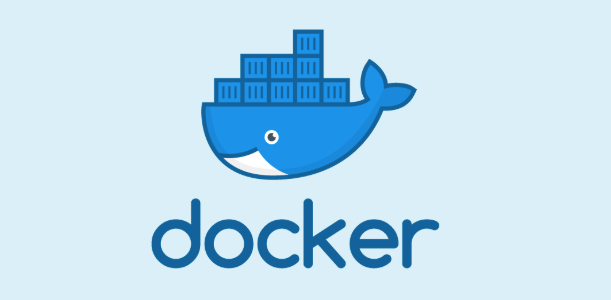
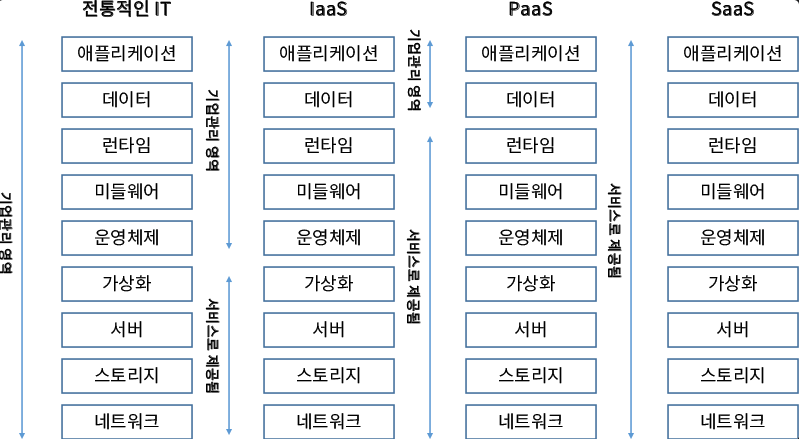
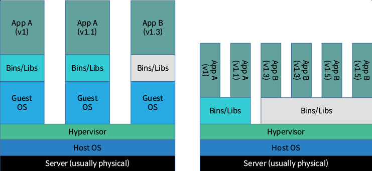

# Docker

<a href="https://www.youtube.com/watch?v=chnCcGCTyBg&t=1s">도커에 대해 5분 Youtube - 노마드코더</a>

## **목차**
- [1. Docker란](#1)
- [2. Docker 사용 이유](#2)
- [3. Docker 장점](#3)
- [4. 클라우드 서비스 모델 비교](#4)
- [5. 기존 VM 가상화와 Docker 가상화의 차이](#5)

 

# 1. Docker란?
- 도커(Docker)는 2013년도에 등장한 컨테이너 기반 가상화 도구로 DevOps 및 개발자 들에게 도움이 되도록 설꼐된 개방형 애플리케이션 개발 프레임워크이다.

- Pycon US 2013에서 솔로몬 하이크(Solomon Hykes)는 라이트닝 토크에서 도커를 처음 소개했으며, 다양한 OS의 응용프로그램들을 컨테이너에 담아 어디서든 쉽게 실행시킬 수 있도록 설계되어 있다.

- 개발 언어는 2009년에 구글에서 출시한 Go언어로 개발되어 있다.

 

# 2. Docker 사용 이유 
같은 업무를 하는 서버를 여러 대 운영하고 있다고 가정할 때,  
각 서버를 운영하기 위해 운영체제부터 컴파일러, 설치된 패키지까지  
같은 환경으로 구축하고자 한다면 모두 완벽하게 동일할지?

또한 Windows 로컬에서 개발을 완료하고  
서버에 올렸을 때 무조건적으로 코드가 정상적으로 작동할지?  

이러한 두 문제들을 "Environment disparity".  
즉, `개발 환경이 일치하지 않아 생기는 문제`들을 항상 겪고있다.  
하지만 Docker를 사용한다면 그 문제들을 겪지않아도 된다.

 

# 3. Docker의 장점 
- 구성 단순화 : 도커는 모든 플랫폼에서 실행할 수 있다. Dockerfile에 전체 운영 환경변수를 담아 전달이 가능하다.  
- 빠른 배포 : 컨테이너는 별도의 OS를 부팅하지 않고, 애플리케이션을 실행하므로 컨테이너를 빠르게 만들 수 있다.
- 코드 관리 : 도커는 환경 자체를 배포하기 때문에 개발 및 코딩을 편하게 만들어준다.
- 개발 생산성 향상 : CentOS 환경의 도커 컨테이너를 실행하는 경우에도 Shared Volume 기능을 통해 Windows 로컬 환경에서 에디터를 통해 소스코드 수정이 가능하므로 업무 효율이 향상된다.
- 애플리케이션 격리 : Web Server와 연결된 API 서버들을 격리해야하는 경우들이 있는데, 이 경우 다른 컨테이너를 통해 API 서버를 실행시킬 수 있다.

 

# 4. 클라우드 서비스 모델 비교

`서비스 단계 : 네트워크 -> 스토리지 -> 서버 -> 가상화 -> 운영체제 -> 미들웨어 -> 런타임 -> 데이터 -> 애플리케이션`

기존 기업에서 관리하는 영역은 네트워크부터 애플리케이션까지 모든 부분을 자체 인프라로 직접 관리를 해야 했다.

하지만 시대가 발전함에 따라 AWS, Azure, GCP와 같은 클라우드 서비스가 등장하고  
인프라를 가상화하여 제공하는 서비스를 통해 사용자는 가상 머신을 만드는게 가능해졌다.  

Docker는 PaaS 블록들 중 하나로 사용 가능하고 컨테이너를 사용하면  
코드, 런타임, 라이브러리와 같은 모든 종속성을 통합하여 가상 환경으로 애플리케이션을 쉽게 생성할 수 있다.

 

# 5. 기존 VM 가상화와 Docker 가상화의 차이

`VM과 Docker Container의 차이는 Host OS 설치여부이다.`

**VM(Virtual Machine)의 경우에는 Physical Hardware를 추상화하여 동작한다.**  
VM의 경우 Hypervisor 위에 Full Host OS(Linux/Winodws)가 올라가고 이를 기반으로 각각의 Bin/libs가 실행된다.  
VM은 하나의 Machine 위에 여러 개의 VM이 동작하고, 각 VM은 OS가 있어야한다.  
CPU, 메모리, 하드디스크 등의 하드웨어를 가상화하고 있기 때문에 하드웨어 OS 부팅 포함 분 단위 시간이 소요된다.  
OS에서 응용 프로그램을 작동하는 경우, 하드웨어 가상화에는 가상화된 하드웨어 및 하이퍼바이저를 통해 처리하기 때문에  
물리적 시스템보다 처리에 부가적인 시간(Overhead)가 필요하다.

**Docker Container의 경우 Application Layer에서 종속되는 패키지 코드를 추상화하여 동작한다.**  
Container는 Linux/Windows와 Host OS기반에 운영되며,  
Container 별로 각각 process 단위로 Bin/lins 가 구동된다.  
Host OS 위에서 Container 가 동작하여 여러 개의 App 형태로 동작을 한다.  
컨테이녀 형 가상화에는 컨테이너 부팅 시 OS는 이미 시작하고 프로세스를 시작 하는데 초 단위 시간이 소요된다.  
컨테이너 형 가상화 커널을 공유하고 개별 프로세스가 작업을 하는 것과 같은 정도의 시간밖에 걸리지 않기 때문에 대부분 오버헤드가 없다.

**Container와 VM의 성능 차이**
기본적으로 "Sysbench"라는 LuaJIT 기반의 다중 스레드 벤치 마크 도구를 통해 성능 측정이 가능하다.  

 
 

> ### 출처 및 참고 : https://artistdata.tistory.com/3