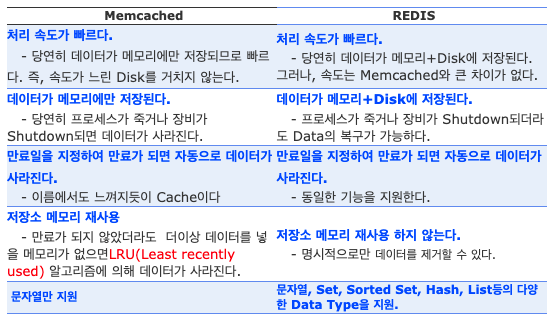

# Redis

## **목차**
- [1. Redis란?](#1)
- [2. Redis와 Memcached](#2)
- [3. Redis의 장점](#3)

 

# Redis란?
Redis는 NoSQL의 일종이라고 한다.

NoSQL 데이터베이스는 단순 검색 및 추가 작업을 위한 매우 최적화된 키 값 저장 공간으로, 레이턴시와 스루풋과 관련하여 상당한 성능 이익을 내는 것이 목적이다. NoSQL 데이터베이스는 빅데이터와 실시간 웹 애플리케이션의 상업적 이용에 널리 쓰인다.

NoSQL은 Not only SQL의 줄임말로 NoSQL 시스템은 SQL 계열 쿼리 언어를 사용할 수 있다는 사실을 강조한다는 면에서 "Not only SQL(SQL뿐만 아니고)"로 불리기도 한다.

Redis 자체도 `RE`mote `DI`ctionary `S`erver의 약어라고 한다.

 

# 2. Redis와 Memcached
Redis는 자주 Memcached와 비교되는 in memory 저장소 이다.

Memcached의 기본적인 특징
1. 처리속도가 빠르다.
    - 데이터가 메모리에만 저장되므로 빠르다. 쯕, 속도가 느린 Disk를 거치지 않는다.
2. 데이터가 메모리에만 저장된다.
    - 당연히 프로세스가 죽거나 장비가 Shutdown되면 데이터가 사라진다.
3. 만요일을 지정하여 만료가 되면 자동으로 데이터가 사라진다.
    - cache 데이터이다.
4. 저장소 메모리 재사용
    - 만료가 되지 않았더라도 더이상 데이터를 넣을 메모리가 없으면 LRU(Least recently used) 알고리즘에 의해 데이터가 사라진다.

Redis는 Memcached와 동일한 기능을 제공하며, 차이는 아래와 같다.  

 

# 3. Redis 의 장점
1. 리스트, 배열 형식의 데이터 처리에 특화되었다.
    - value 값으로 문자열, 리스트, set, sorted set, hash 형 등 여러 데이터 형식을 지원한다.
    - **`리스트 형 데이터의 입력과 삭제가 MySQL에 비하여 10배 정도 빠르다.`**

2. 여러 프로세스에서 동시에 같은 key에 대한 갱신을 요청할 경우 Atomic 처리로 데이터 부정합 방지 Atomic 처리 함수를 제공한다.

3. 메모리를 활용하면서 영속적인 데이터 보존
    - 명령어로 명시적으로 삭제하거나 expires를 설정하지 않으면 데이터를 삭제하지 않는다.
    - 스냅샷(기억장치) 기능을 제공하여 메모리의 내용을 *.rdb 파일로 저장하여 해당 시점으로 복구할 수 있다.

4. 여러 대의 서버 구성
    - Consistent hashing 혹은 master-slave 형식으로 구성 가능하다.
        - Redis에는 5가지의 데이터 타입이 존재한다. (String, Lists, Sets, Sorted Sets, Hashes)

        1. String (일반적인 key-value)
            - String이라고 해서 문자열만 저장할 수 있는게 아니라, 이진 데이터도 저장 가능(정수, 실수형이 따로 없다.)
            - Key에 넣을 수 있는 데이터의 최대 크기는 512MB 이다.  
        2. Lists (Array 형태로 key 1개에 n개의 값을 가짐, 중복 값 가능)
            - 배열이라고 생각해도 된다.
            - 한 key에 넣을 수 있는 요소의 최대 개수는 4,294,968,295개 이다.
            - 데이터 형의 값은 설정파일에서 정해준 조건보다 큰 경우 linkedList 아니면 zipList로 encoding 된다.
        3. Sets (Group 형태로 key 1개에 n개의 중복되지 않는 값을 가진다.)
            - 정렬되지 않은 집합형으로 key에 중복된 데이터는 존재하지 않는다.
            - 추가, 제거 및 존재 체크 시 소모되는 시간이, sets에 포함된 요소의 수와 관계없이 일정하다.
            - 한 key에 넣을 수 있는 요소의 최대 개수는 4,294,967,295개 이다.
            - 데이터 형의 값은 설정파일에서 정해준 조건보다 큰 경우 linkedList 아니면 zipList로 encoding 된다.
        4. Sorted Sets (Group 형태이나 각 member에 score 값을 가진다. key-member-score)
            - Sorted Sets는 가장 진보한 Redis 데이터 형이라고 한다.
            - 요소의 추가, 제거, 업데이트는 매우 빠른 방법으로 진행되는데 이는 "요소의 개소의 로그"에 비례하는 시간이 사용된다.
            - 랭킹 시스템 등에서 사용되기 좋다.
            - sets의 각 요소마다 score라는 실수 값을 가지고 있는 형태로 score 값으로 오름차순 정렬된다.
            - key에 중복된 데이터는 존재하지 않지만 score 값은 중복 가능하다.
        5. Hashes (Object 형태의 key-field-value)
            - list와 비슷한데 "필드명", "필드값"의 연속으로 이루어져 있다.
            - 한 key에 넣을 수 있는 요소의 최대 개수는 4,294,967,295개 이다.
            - 데이터 형의 값은 설정파일에서 정해준 조건보다 큰 경우 linkedList 아니면 zipList로 encoding 된다.

 
 

> ### 출처 및 참고 : https://genesis8.tistory.com/189