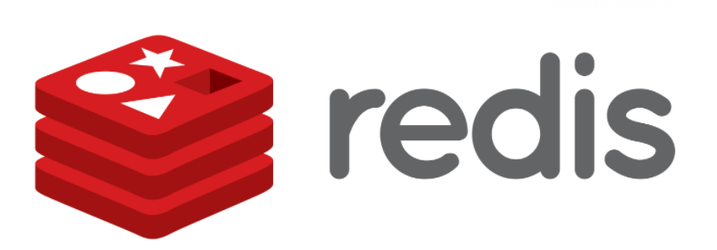

# Redis

## **목차**
- [1. Redis란?](#1)
- [2. Redis와 Memcached차이](#2)
- [3. Redis 사용 사례](#3)

 

# Redis란?
Redis는 NoSQL의 일종이라고 한다.

NoSQL 데이터베이스는 단순 검색 및 추가 작업을 위한 매우 최적화된 키 값 저장 공간으로, 레이턴시와 스루풋과 관련하여 상당한 성능 이익을 내는 것이 목적이다. NoSQL 데이터베이스는 빅데이터와 실시간 웹 애플리케이션의 상업적 이용에 널리 쓰인다.

NoSQL은 Not only SQL의 줄임말로 NoSQL 시스템은 SQL 계열 쿼리 언어를 사용할 수 있다는 사실을 강조한다는 면에서 "Not only SQL(SQL뿐만 아니고)"로 불리기도 한다.

Redis 자체도 `RE`mote `DI`ctionary `S`erver의 약어라고 한다.

Redis는 