# Design Pattern

## **목차**
- [1. 디자인 패턴 용도에 따라 나누기](#1)
- [2. 생성 패턴(Creational Pattern)](#2)
- [3. 행동 패턴(Behavioral Pattern)](#3)
- [4. 구조 패턴(Structural Pattern)](#4)

## 1. 디자인 패턴 용도에 따라 나누기 <a id="1"></a>

대부분의 카탈로그에서는 몇 가지 범주에 맞춰서 디자인 패턴을 분류하고 있다. 그 중 제일 유명한 분류 방법은 맨 처음 출간되었던 **패턴 카탈로그에서 제시한 생성, 행동, 구조라는 3가지 범주로 용도에 따라 나누기** 이다.


## **2. 생성 패턴(Creational Pattern)** <a id="2"></a>
- 객체 인스턴스를 생성하는 패턴으로, 클라이언트와 그 클라이언트가 생성해야 하는 객체 인스턴스 사이의 연결을 끊어 주는 패턴이다.

<br/>

### **싱글턴 패턴 (Singleton Pattern)**
```
특정 클래스에 객체 인스턴스가 하나만 만들어지도록 해주는 패턴이다.  
싱글턴 패턴을 사용하면 전역 변수를 사용할 때와 마찬가지로 객체 인스턴스를 어디서든지 액세스 할 수 있게 만들 수 있다.  
클래스 인스턴스를 하나만 만들고 그 인스턴스로의 전역 접근을 제공한다.
```

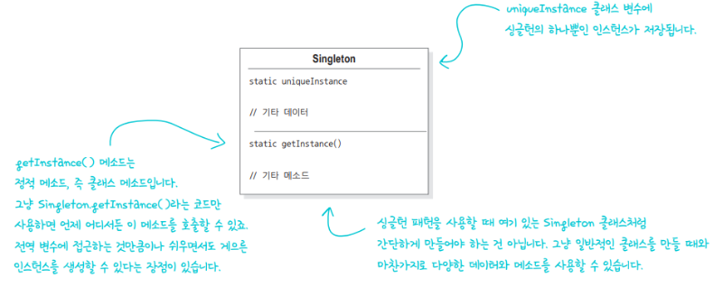

<br/>

### **추상 팩토리 패턴(Abstract Factory Pattern)**
```
구상 클래스에 의존하지 않고도 서로 연관되거나 의존적인 객체로 이루어진 제품군을 생산하는 인터페이스를 제공한다.  
구상 클래스는 서브 클래스에서 만든다.
```

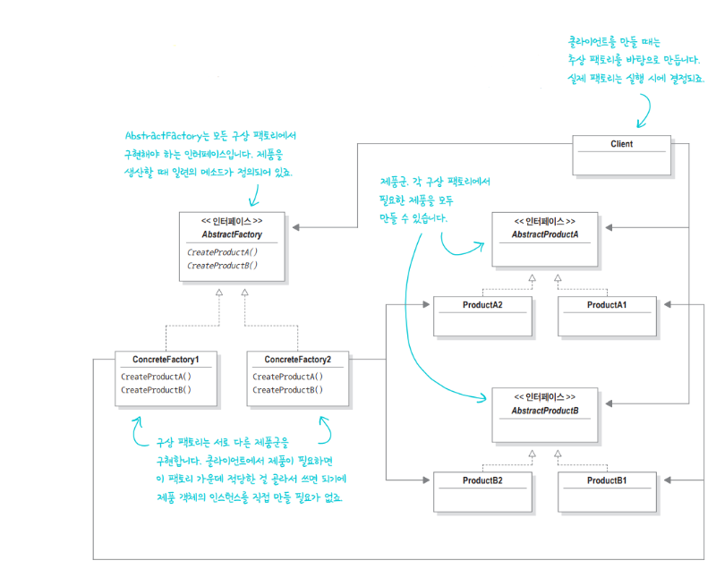

<br/>

### **팩토리 메소드 패턴(Factory Method Pattern)**
```
객체를 생성할 때 필요한 인터페이스를 만든다.  
어떤 클래스의 인스턴스를 만들지는 서브클래스에서 결정한다.  
팩토리 메소드 패턴을 사용하면 클래스 인스턴스 만드는 일을 서브클래스에게 맡기게 된다.
```

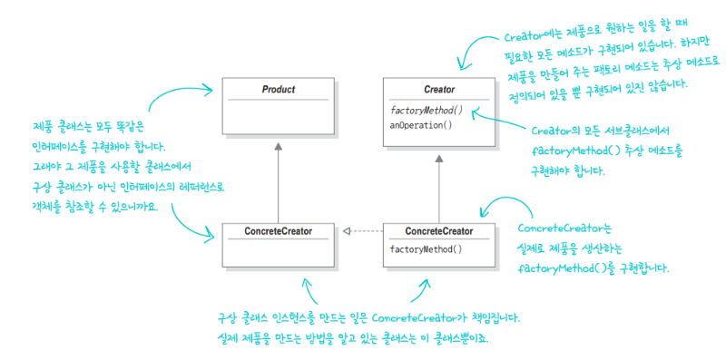

<br/>
<br/>

## **3. 행동 패턴(Behavioral Pattern)** <a id="3"></a>
- 클래스와 객체들이 상호작용하는 방법과 역할을 분담하는 방법을 다루는 패턴이다.

### **템플릿 메소드 패턴(Template Method Pattern)**
```
알고리즘의 골격을 정의한다.  
템플릿 메소드를 사용하면 알고리즘 일부 단계를 서브클래스에서 구현할 수 있으며, 알고리즘의 구조는 그대로 유지하면서 알고리즘의 특정 단계를 서브클래스에서 재정의할 수도 있다.
```

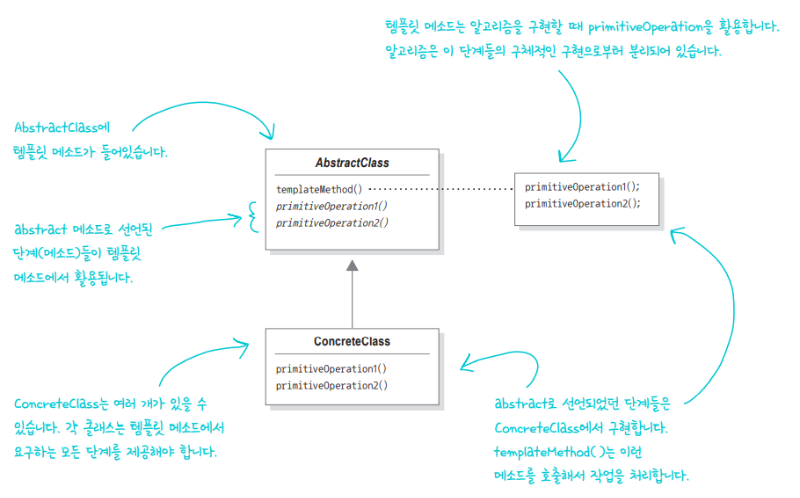

<br/>

### **싱글턴 패턴(Singleton Pattern)**
```
특정 클래스에 객체 인스턴스가 하나만 만들어지도록 해주는 패턴이다.  
싱글턴 패턴을 사용하면 전역 변수를 사용할 때와 마찬가지로 객체 인스턴스를 어디서든지 액세스 할 수 있게 만들 수 있다.  
클래스 인스턴스를 하나만 만들고 그 인스턴스로의 전역 접근을 제공한다.
```


<br/>

### **상태 패턴(State Pattern)**
```
상태 패턴을 사용하면 객체의 내부 상태가 바뀜에 따라서 객체의 행동을 바꿀 수 있다.  
마치 객체의 클래스가 바뀌는 것과 같은 결과를 얻을 수 있다.
```

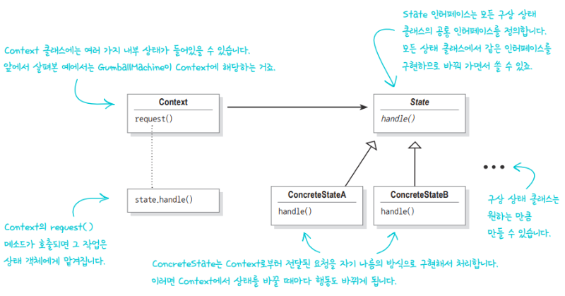

<br/>

### **반복자 패턴(Iterator Pattern)**
```
컬렉션의 구현 방법을 노출하지 않으면서 집합체 내의 모든 항목에 접근하는 방법을 제공한다.
```

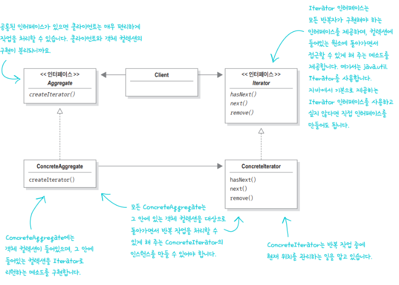

<br/>

### **전략 패턴(Strategy Pattern)**
```
알고리즘군을 정의하고 캡슐화해서 각각의 알고리즘군을 수정해서 쓸 수 있게 해준다.  
전략 패턴을 사용하면 클라이언트로부터 알고리즘을 분리해서 독립적으로 변경할 수 있다.
```

<br/>

### **옵저버 패턴(Observer Pattern)**
```
한 객체의 상태가 바뀌면 그 객체에 의존하는 다른 객체에게 연락이 가고 자동으로 내용이 갱신되는 방식으로 일대다 의존성을 정의한다.
```

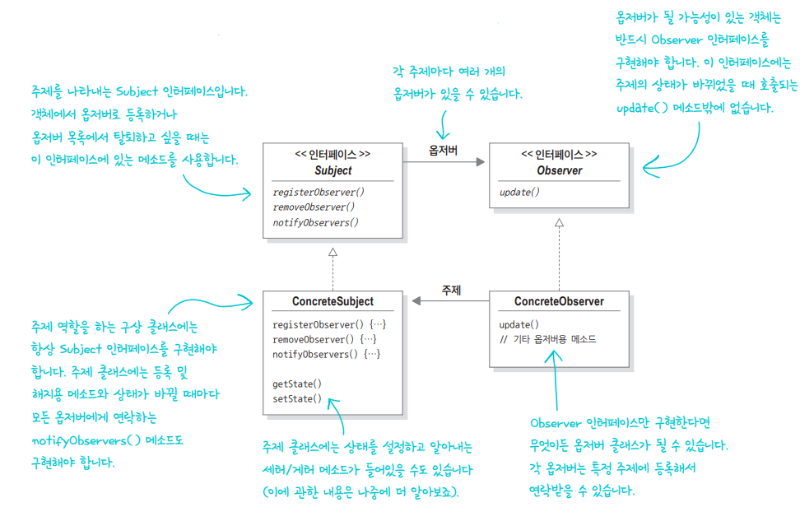

<br/>
<br/>

## **4. 구조 패턴(Structural Pattern)** <a id="4"></a>
- 클래스와 객체를 더 큰 구조로 만들 수 있게 구상을 사용하는 패턴이다.

### **데코레이터 패턴(Decorator Pattern)**
```
데코레이터 패턴으로 객체에 추가 요소를 동적으로 더할 수 있다.  
데코레이터를 사용하면 서브클래스를 만들 때보다 훨씬 유연하게 기능을 확장할 수 있다.
```

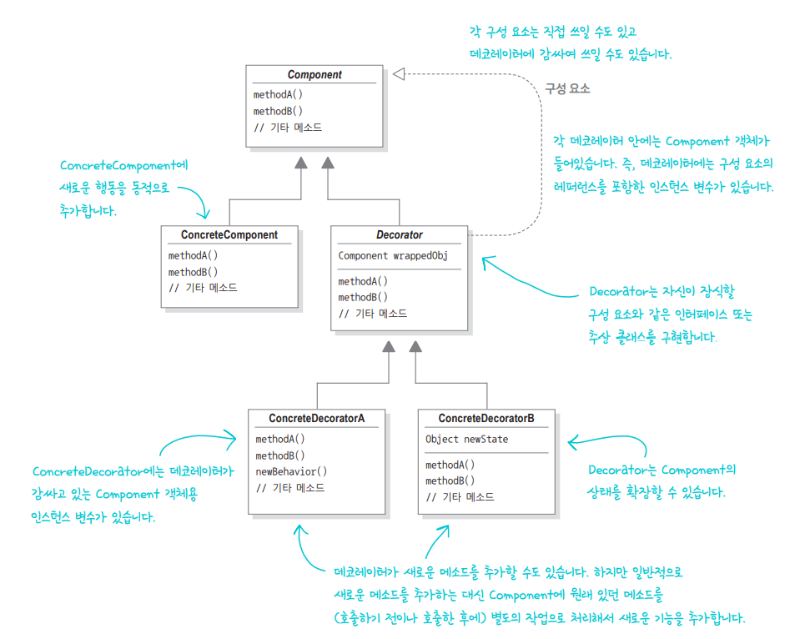

<br/>

### **프록시 패턴(Proxy Pattern)**
```
특정 객체로의 접근을 제어하는 대리인(특정 객체를 대변하는 객체)을 제공한다.
```

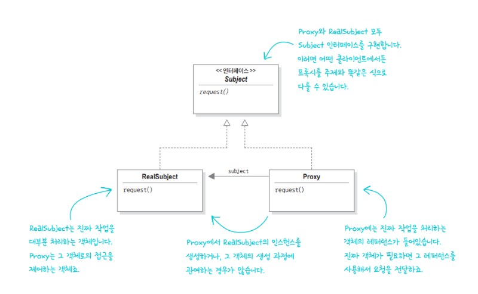

<br/>

### **컴포지트 패턴(Composite Pattern)**
```
컴포지트 패턴으로 객체를 트리구조로 구성해서 부분-전체 계층구조를 구현한다.  
컴포지트 패턴을 사용하면 클라이언트에서 개별 객체와 복합 객체를 똑같은 방법으로 다룰 수 있다.
```

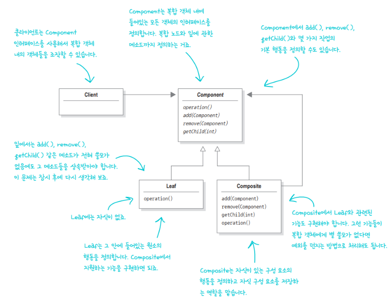

<br/>

### **어댑터 패턴(Adapter Pattern)**
```
특정 클래스 인터페이스를 클라이언트에서 요구하는 다른 인터페이스로 변환한다.  
인터페이스가 호환되지 않아 같이 쓸 수 없었던 클래스를 사용할 수 있게 도와준다.
```

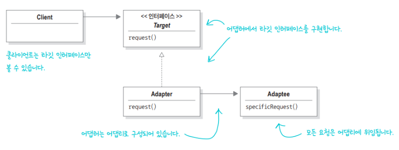

<br/>

### **퍼사드 패턴(Facade Pattern)**
```
서브시스템에 있는 일련의 인터페이스를 통합 인터페이스로 묶어준다.  
또한 고수준 인터페이스도 정의하므로 서브시스템을 더 편리하게 사용할 수 있다.
```


> 출처 : https://m.hanbit.co.kr/channel/category/category_view.html?cms_code=CMS8616098823