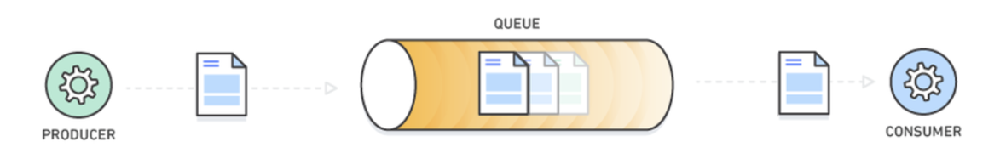
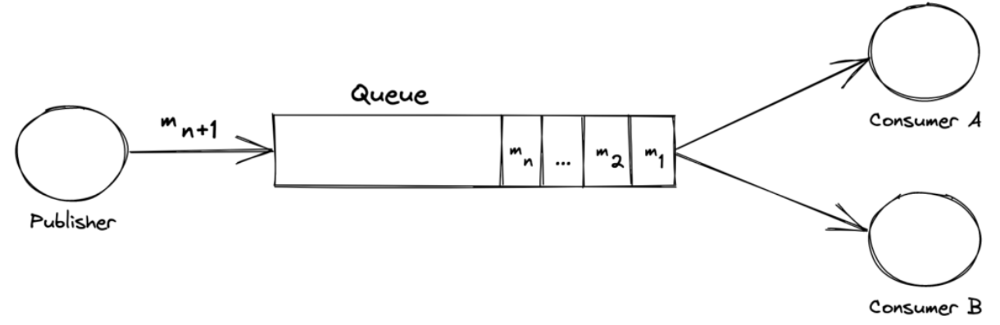
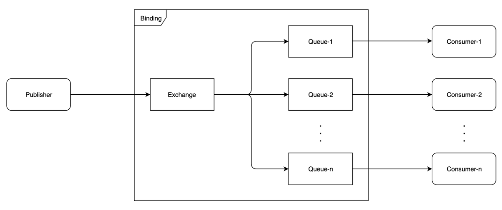
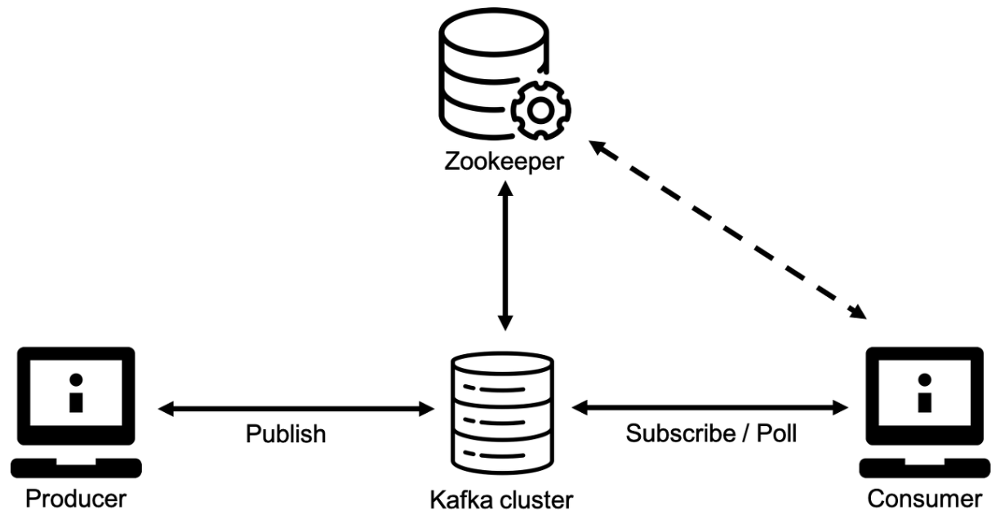

# 메시지큐 (Message Queue)

## **목차**
- [1. Message Queue란?](#1)
- [2. Messqge Queue는 언제쓰는지?](#2)
- [3. Messqge Queue 장점](#3)
- [4. Messqge Queue 종류](#4)

 
 

## 1. Message Queue란? 

- 최신 클라우드 아키텍처에서는 어플리케이션이 좀 더 쉽게 개발, 배포 및 유지 관리할 수 있도록 더 작고 독립적인 모듈로 구성한다.
- MQ는 이러한 분산 애플리케이션을 위한 통신 및 조정 기능을 제공한다.
- MQ는 각 모듈 애플리케이션의 코딩을 상당히 간소화하면서 동시에 성능, 안정성 및 확장성을 개선할 수 있도록 한다.
- MQ를 사용하면 시스템의 서로 다른 부분이 통신하고 비동기식으로  작업을 처리할 수 있다.
- MQ는 메시지를 임시로 저장하는 간단한 버퍼를 제공하고, 메시지를 전송 및 수신하기 위해 소프트웨어 구성 요소가 queue에 연결하도록 허용하는 엔드포인트를 제공한다.
- 메시지는 보통 크기가 작으며, 요청, 오류 메시지 또는 평범한 정보가 될 수 있다.
- 메시지를 전송하려면 생산자(producer)라고 부르는 구성 요소가 메시지를 대기열에 추가한다.
- 해당 메시지는 소비자(consumer)라고 부르는 또 다른 구성 요소가 메시지를 검색하고 이를 사용해 어떤 작업을 수행할 때까지 해당 queue에 저장된다.

 

## 2. Message Queue는 언제쓰는지? 
- 메시지 큐는 소비자(Consumer)가 실제로 메시지를 어느 시점에 가져가서 처리하는 지는 보장하지 않는다.
- 언젠가는 큐에 넣어둔 메시지가 소비되어 처리될 것이라고 믿는 것이다.
- 이러한 비동기적 특성 때문에 메시지 큐는 실패하면 치명적인 핵심 작업보다는 어플리케이션의 부가적인 기능에 사용하는 것이 적합하다.

예를 들면, 이메일전송과 같은 작업이 있을 수 있다.  
나는 이미 이메일을 전송했고, 실제 받는 사람이 읽을 때까지 시간은 걸리겠지만, 해당 작업이 완료처리 될 것을 우리는 알고있다.
바로 실시간으로 처리되지 않아도 서비스에 크게 문제 없는 이런 작업에 MQ를 사용할 수 있다.  
즉, MQ는 어느 정도의 응답 지연이 허용되며, 어플리케이션의 핵심 기능은 아닌 경우에 사용하는 것이 적합하다.

 

 

## 3. Message Queue 장점 
- **비동기(Asynchronous)**
    - 메시지 큐는 생산된 메시지의 저장, 전송에 대해 동기화 처리를 진행하지 않고, 큐에 넣어 두기 때문에 나중에 처리할 수 있다.
    - 여기서, 기존 동기화 방식은 많은 메시지(데이터)가 전송될 경우 병목이 생길 수 있고, 뒤에 들어오는 요청에 대한 응답이 지연될 것이다.
- **낮은 결합도(Decoupling)**
    - 생산자 서비스와 소비자 서비스가 독립적으로 행동하게 됨으로써 서비스간 결합도가 낮아진다.
- **확장성(Scalable)**
    - 생산자 서비스 혹은 소비자 서비스를 원하는대로 확장할 수 있기 때문에 확장성이 좋다.
- **탄력성(Resilience)**
    - 소비자 서비스가 다운되더라도 어플리케이션이 중단되는 것은 아니다. 메시지는 메시지 큐에 남아 있다. 소비자 서비스가 다시 시작될 때마다 추가 설정이나 작업을 수행하지 않고도 메시지 처리를 시작할 수 있다.
- **보장성(Guarantees)**
    - 메시지 큐는 큐에 보관되는 모든 메시지가 결국 소비자 서비스에게 전달된다는 일반적인 보장을 제공한다.

 

## 4. Message Queue 종류 
MQ의 종류로는 여러가지가 있는데 Kafka, RabbitMQ, ActiveMQ(JMS)가 대표적이다. Amazon SQS, Amazon MQ 등도 있다.

 

- **ActiveMQ(JMS)**
    - MOM을 자바에서 지원하는 표준이다. JMS(Java Message Service)는 다른 자바 어플리케이션들끼리 통신이 가능하지만 다른 MOM의 통신은 불가능하다. (AMQP, SMTP 같은)
    - ActiveMQ의 JMS 라이브러리를 사용한 자바 애플리케이션들끼리 통신이 가능하다.
    - 하지만 다른 자바 애플리케이션(Non ActiveMQ)의 JMS와는 통신할 수 없다.

- **RabbitMQ**
    - RabbitMQ는 AMQP(Advanced Message Queuing Protocol)를 구현한 오픈소스 메시지 브로커이다.
    - AMQP는 MQ를 오픈 소스에 기반한 표준 프로토콜이다. 프로토콜만 맞다면 다른 AMQP를 사용한 애플리케이션끼리 통신이 가능하다.
    - 플러그인을 통해서 SMTP, STOMP 프로토콜과의 확장이 가능하다.
    - AMQP는 메시지 전달을 아래 3가지 방식 중 하나를 보장한다.
        - At-Most-Once: 각 메시지는 한번만 전달되거나 전달되지 않음
        - At-Least-Once: 각 메시지는 최소 한번 이상 전달됨을 보장
        - Exactly-Once: 각 메시지는 딱 한번만 전달됨
    - AMQP는 메시징 제공자와 클라이언트의 동작에 대해 각기 다른 벤더들의 구현체가 상호 운용될 수 있는 정도로까지 권한을 준다.
    - 이는 SMTP, HTTP, FTP 등이 상호 운용이 가능한 시슨템을 만든다는 점에서 동일하다.
    - 간단히 말하면 Exchange가 Producer로부터 메시지를 받고 Queue에 전달한다. Queue는 Consumer에게 메시지를 전달한다.

 

- **Apache Kafka**
    - Apache Kafka는 LinkedIn이 개발하고 Apache Software Foundation에 기부한 오픈 소스 스트림 프로세싱 소프트웨어 플랫폼이다.
    - 높은 처리량을 요구하는 실시간 데이터 피드 처리나 대기 시간이 짧은 플랫폼을 제공하는 것을 목표로 하며 TCP 기반 프로토콜을 사용한다.
    - 클러스터를 중심으로 Producer와 Consumer가 데이터를 Push하고 Pull하는 구조를 가진다.

    
    - **특징**
        - Publisher / Subscriber 모델
        - 고가용성
        - 확장성
        - 디스크 순차 저장 및 처리
        - 분산 처리(partitioning)
    - 카프카는 내구성이 뛰어난 메시지 저장소로, 고객들은 메시지가 한 번에 배달되면 대기열에서 제거되는 전통적인 메시지 중개업자들과는 달리, `필요에 따라 이벤트 스트림을 재생`할 수 있다.
    - 대용량의 실시간 로그 처리에 특화되어 설계된 메시징 시스템으로써 기존 범용 메시징 시스템대비 `TPS(Transaction Per Second)가 매우 우수`하다. 단, 특화된 시스템이기 때문에 범용 메시징 시스템에서 제공하는 다양한 기능들은 제공되지 않는다.
    - 분산 시스템을 기본으로 설계되었기 때문에 `기존 메시징 시스템에 비해 분산 및 복제 구성을 손쉽게 할 수 있다.`
    - AMQP 프로토콜이나 JMS API를 사용하지 않고 단순한 메시지 헤더를 지닌 TCP기반의 프로토콜을 사용하여 프로토콜에 의한 오버헤드를 감소시켰다.
    - Producer가 Broker에게 다수의 메시지를 전송할 때 각 메시지를 개별적으로 전송해야하는 기존 메시지 시스템과는 달리, 다수의 메시지를 batch형태로 Broker에게 한 번에 전달할 수 있어 TCP/IP 라운드 트립 횟수를 줄일 수 있다.
    - 메시지를 기본적으로 메모리에 저장하는 기본 메시징 시스템과는 달리 `메시지를 파일 시스템에 저장`한다. (RabbitMQ는 ram or disk 선택가능)
    - `파일 시스템에 메시지를 저장하기 때문에 별도의 설정을 하지 않아도 데이터의 영속성이 보장`된다.
    - 기존 메시징 시스템에서는 처리되지 않고 남아있는 메시지의 수가 많을수록 시스템의 성능이 크게 감소하였으나, `Kafka에서는 메시지를 파일 시스템에 저장하기 때문에 메시지를 많이 쌓아두어도 성능이 크게 감소하지 않는다. 또한 많은 메시지를 쌓아둘 수 있기 때문에, 실시간 처리뿐만 아니라 주기적인 batch 작업에 사용할 데이터를 쌓아두는 용도로도 사용`할 수 있다.
    - Consumer에 의해 처리된 메시지(ack)를 곧바로 삭제하는 기존 메시징 시스템과는 달리 처리된 메시지를 삭제하지 않고 파일 시스템에 그대로 두었다가 설정된 수명이 지나면 삭제한다. 처리된 메시지를 일정 기간동안 삭제하지 않기 때문에 메시지 처리 도중에 문제가 발생하였거나 처리 로직이 변경되었을 경우 Consumer가 메시지를 처음부터 다시 처리(rewind)하도록 할 수 있다.
    - 기존의 메시징 시스템에서는 Broker가 Consumer에게 메시지를 Push해주는 방식인데 반해, `Kafka는 Consumer가 Broker로부터 직접 메시지를 가지고 가는 pull(poliing)방식으로 동작`한다. 
    - 따라서 Consumer는 자신의 처리능력만큼의 메시지만 Broker로부터 가져오기 때문에 최적의 성능을 낼 수 있다.
    - 메시지를 Pull 방식으로 가져오므로, 메시지를 쌓아두었따가 주기적으로 처리하는 Batch Consumer의 구현이 가능하다.
    - 큐의 기능은 JMS, AMQP 기반의 RabbitMQ등에 비해서는 많이 부족하지만 대용량 메시지를 지원할 수 있는 것이 가장 큰 특징이다. 특히 분산 환경에서 복사본을 다른 노드에 저장함으로써 노드 장애에 대한 장애 대응성을 가지고 있는 강점이 있다.

 
 

> 출처 : https://goyunji.tistory.com/125