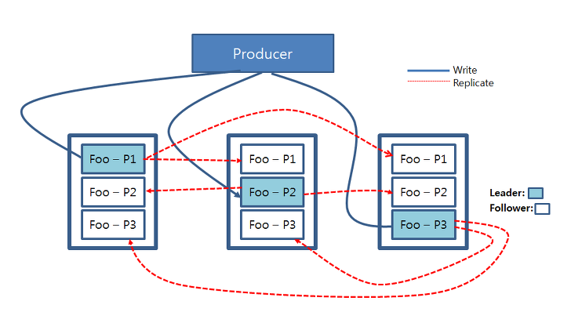
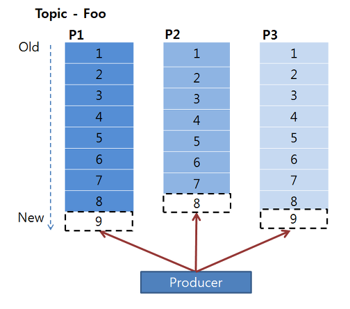
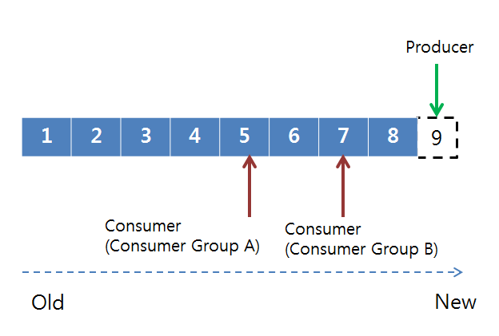
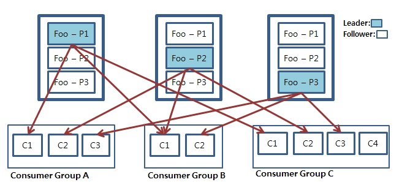

# 아파치 카프카 (Apache Kafka)

## **목차**
- [1. Apache Kafka란?](#1)
- [2. Apache Kafka 특징](#2)
- [3. Apache Kafka 사용 이유](#3)
- [4. 아키텍처 및 구성](#4)
- [5. 파티션 읽기, 쓰기](#5)

## 1. Apache Kafka란? 

아파치 카프카(Apache Kafka)는 `분산 스트리밍 플랫폼`이며 데이터 파이프 라인을 만들 때 주로 사용되는 오픈소스 솔루션이다.  
카프카는 대용량의 실시간 로그처리에 특화되어 있는 솔루션이며 데이터를 유실없이 안전하게 전달하는 것이 주 목적인 메시지 시스템에서 **Fault_Tolerant** 한 안정적인 아키텍처와 빠른 퍼포먼스로 데이터를 처리할 수 있다.
`

## 2. Apache Kafka 특징 

 - **Publisher Subscriber 모델** : `Publisher Subscriber 모델`은 데이터 큐를 중간에 두고 서로 간 독립적으로 데이터를 생산하고 소비한다. 이런 느슨한 결합을 통해 `Publisher`나 `Subscriber`가 죽을 시, 서로 간에 의존성이 없으므로 안정적으로 데이터를 처리할 수 있다. 또한 설정 역시 간단하게 할 수 있다는 장점이 있다.
 - **고가용성(High availability) 및 확장성(Scalability)** : 카프카는 클러스터로서 작동한다. 클러스터로서 작동하므로 **Fault-Tolerant** 한 고가용성 서비스를 제공할 수 있고 `분산처리를 통해 빠른 데이터 처리를 가능`하게 한다. 또한 `서버를 수평적으로 늘려 안정성 및 성능을 향상시키는 `**Scale-out**` 이 가능`하다.
 - **디스크 순차 저장 및 처리(Sequential Store and Process in Disk)** : 메시지를 메모리 큐에 적재하는 기존 메시지 시스템과 다르게 카프카는 메시지를 디스크에 순차적으로 저장한다. 이로서 얻는 이점은 두가지이다.
    - 1. 서버에 장애가 나도 메시지가 디스크에 저장되어 있으므로 유실 걱정이 없다.
    - 2. 디스크가 순차적으로 저장되어 있으므로 디스크 I/O가 줄어들어 성능이 빨라진다.
 - **분산 처리(Distributed Processing)** : 카프카는 파티션(Partition)이란 개념을 도입하여 여러개의 파티션을 서버들에 분산시켜 나누어 처리할 수 있다. 이로서 메시지를 상황에 맞추어 빠르게 처리할 수 있다.

  

## 3. Apache Kafka 사용 이유 
1. **병렬처리에 의한 데이터 처리율 향상** : 카프카는 데이터를 병렬로 처리함으로서 데이터를 빠르고 효과적으로 처리할 수 있다. disk에 순차적으로 데이터를 적재하기 때문에 임의의 접근(random acess) 방식보다 훨씬 더 빠르게 데이터를 처리한다.
2. **데이터 유실 방지** : disk에 적재되기 때문에 만약 불의의 사고로 서버가 다운되었을 시에도 데이터가 유실되는 일 없이 재시작하여 기존 데이터를 안정적으로 처리 가능하다.
3. **클러스터링에 의한 고가용성 서비스** : Scale-out이 가능하여 시스템 확장이 용이하며 어떤 하나 혹은 몇 개의 서버가 다운되도 서비스 자체가 중단될 일 없이 시스템 운용이 가능하다.

## 4. 아키텍처 및 구성(Architecture and Components) 

카프카 클러스터를 중심으로 Producer와 Consumer가 Push하고 Pull 하는 구조이다. Producer, Comsumer는 각기 다른 프로세스에서 비동기로 동작한다.

- **프로듀서(Producer)** : 데이터를 발생시키고 `카프카 클러스터(Kafka Cluster)`에 적재하는 프로세스이다.
- **카프카 클러스터(Kafka Cluster)** : 카프카 서버로 이루어진 클러스터를 말한다. 카프카 클러스터를 이루는 요소는 다음과 같다.
    - **브로커(Broker)** : 카프카 서버를 말한다.
    - **`주키퍼(Zookeeper)`** : `주키퍼(Zookeeper)`는 분산 코디네이션 시스템이다. 카프카 브로커를 하나의 클러스터로 코디네이팅하는 역할을 하며 아래 나올 카프카 클러스터의 `리더(Leader)`를 발탁하는 방식도 주키퍼가 제공하는 기능을 이용한다.
    - **`토픽(Topic)`** : 카프카 클러스터에 데이터를 관리할 시 그 기준이 되는 개념이다. 토픽은 카프카 클러스터에서 여러개 만들 수 있으며 하나의 토픽은 1개 이상의 `파티션(Partition)`으로 구성되어 있다. 어떤 데이터를 관리하는 하나의 그룹
    - **파티션(Partition)** : 각 토픽당 데이터를 분산 처리하는 단위이다. 카프카에서는 토픽 안에 파티션을 나누어 그 수대로 데이터를 분산처리한다. 카프카 옵션에서 지정한 `replica`의 수 만큼 파티션이 각 서버들에게 복제된다.
    - **리더, 팔로워(Leader, Follower)** : 카프카에서는 각 파티션당 복제된 파티션 중에서 하나의 리더가 선출된다. 이 리더는 모든 읽기, 쓰기 연산을 담당한다. 리더를 제외한 나머지는 팔로워가 되고 이 팔로워들은 단순히 리더의 데이터를 복사하는 역할만 하게 된다.
- **컨슈머그룹(Consumer Group)** : 컨슈머의 집합을 구성하는 단위이다. 카프카에서는 컨슈머 그룹으로서 데이터를 처리하며 컨슈머 그룹 안의 컨슈머 수 만큼 파티션의 데이터를 분산처리하게 된다.

위 그림은 `Producer`가 데이터를 카프카에 적재하고 있으며, 그 저장된 데이터를 `Consumer Group A`와 `B`가 각각 자신이 처리해야될 `Topic Foo`와 `Bar`를 가져오는 그림이다.

`Foo`와 `Bar`는 각각 3개의 파티션으로 나뉘어져 있으며, 이 각각의 파티션들은 3개의 복제본으로 복제된다. 3개의 복제본 중에는 하나의 리더가 선출되고 이 리더가 모든 데이터의 읽기, 쓰기, 연산을 담당하게 된다.  
중요한 것은 이 파티션들은 운영 도중 그 수를 늘릴 수 있지만 **`절대 줄일 수 없다.`** 이 때문에 파티션을 늘리는 것은 신중하게 고려해서 결정해야될 문제가 된다.

카프카 클러스터에서 데이터를 가져오게 될 때는 **`컨슈머 그룹(Consumer Group)단위로 가져오게 된다.`** 이 컨슈머 그룹은 자신이 가져와야하는 토픽 안의 파티션의 데이터를 `Pull` 하게 되고 각각 컨슈머 그룹은 그룹안의 컨슈머들이 파티션이 나뉘어져 있는 만큼 데이터를 처리하게 된다.

## 5. 파티션 읽기, 쓰기(Kafka Partition, Read, Write) 

**`아파치 카프카에서의 쓰기, 읽기 연산은 카프카 클러스터 내의 리더 파티션들에게만 적용된다.`** 하늘색으로 칠해진 각 파티션들은 리더 파티션이며, 이 파티션들에게 프로듀서가 쓰기 연산을 진행한다. 그리고 리더 파티션에 쓰기가 진행되고 난 후 업데이트된 데이터는 각 파티션들의 복제본들에게로 복사된다.

아래는 프로듀서가 어떻게 각 파티션들에 `Write` 연산을 진행하는지 설명하는 그림이다.

카프카는 데이터를 순차적으로 디스크에 저장한다. 따라서 프로듀서는 순차적으로 저장된 데이터 뒤에 붙이는 `append` 형식으로`write` 연산을 진행하게 된다. 이 떄 파티션들은 각각의 데이터들의 순차적인 집합인 `오프셋(offset)`으로 구성되어 있다.

컨슈머그룹의 컨슈머들은 파티션의 오프셋을 기준으로 데이터를 순차적으로 처리하게 된다.(선입선출:FIFO) 중요한 것은 컨슈머들은 컨슈머 그룹으로 나뉘어서 데이터를 분산처리하게 되고 같은 컨슈머 그룹내에 있는 컨슈머끼리 같은 파티션의 데이터를 처리할 수 없다.

파티션에 저장되어 있는 데이터들은 순차적으로 데이터가 저장되어 있으며 이 데이터들은 설정값에 따라 데이터를 디스크에 보관하게 된다.

위 그림은 컨슈머 그룹단위로 그룹 내 컨슈머들이 각각의 파티션의 데이터를 처리하는 모습을 나타낸 것이다.

만일 컨슈머와 파티션의 개수가 같다면 컨슈머는 각 파티션을 1:1로 맡게 된다. 만일 컨슈머 그룹 안의 컨슈머의 개수가 파티션의 개수보다 적을 경우 컨슈머 중 하나가 남는 파티션의 데이터를 처리하게 된다. 만약 컨슈머의 개수가 파티션의 개수보다 많을 경우 컨슈머는 파티션의 개수가 많아질 때까지 대기한다.

> 출처 : https://engkimbs.tistory.com/691