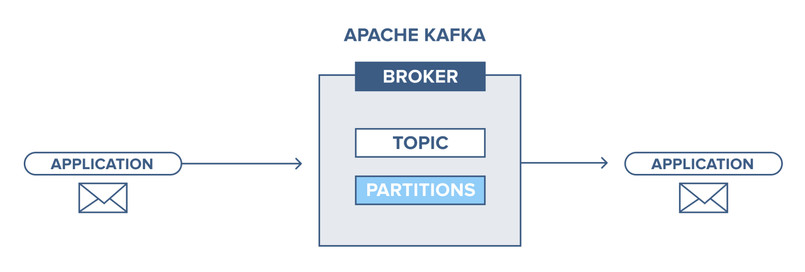
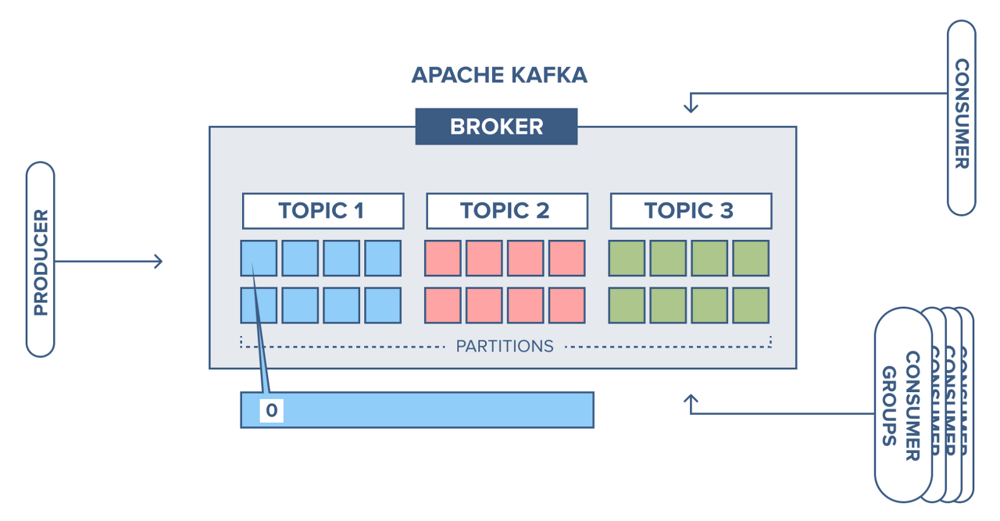
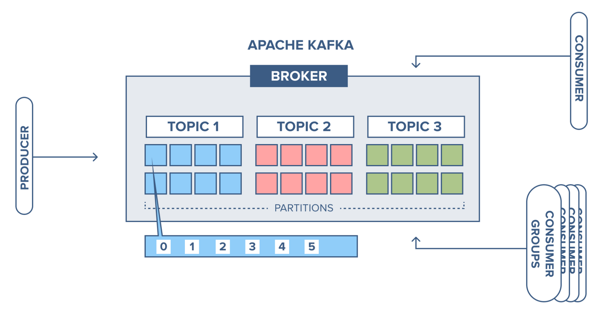
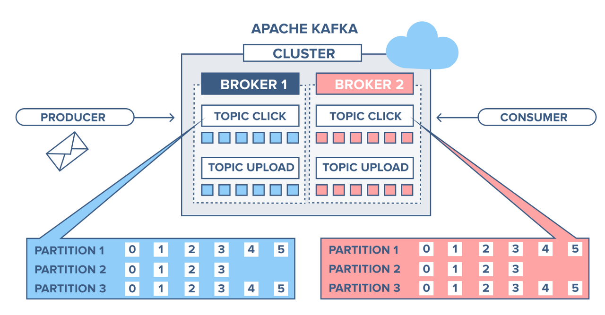
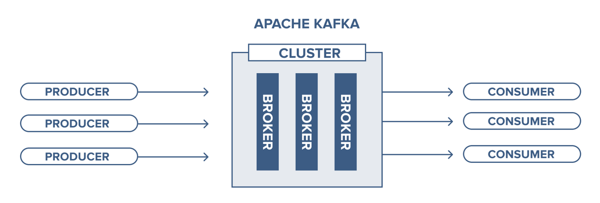
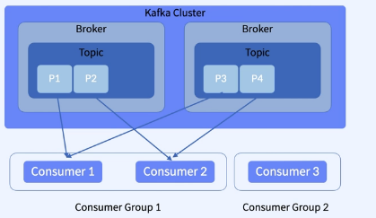
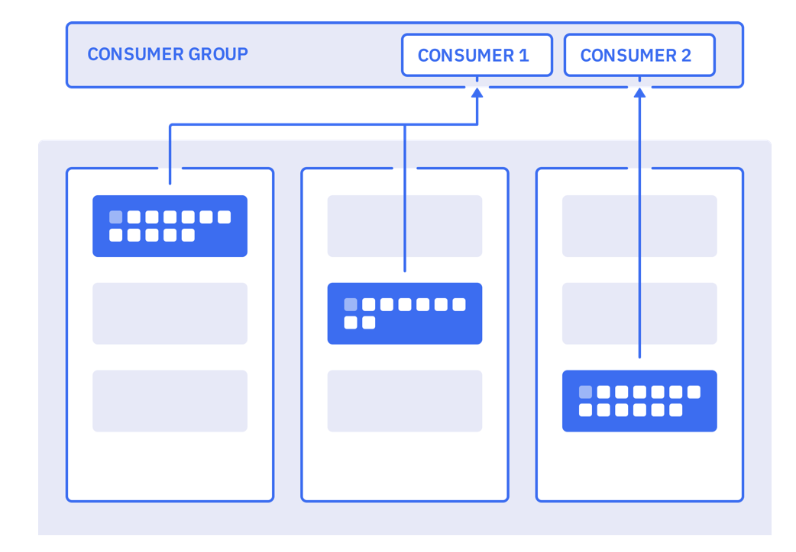
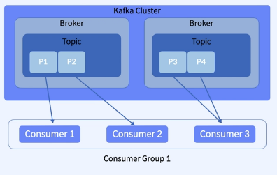
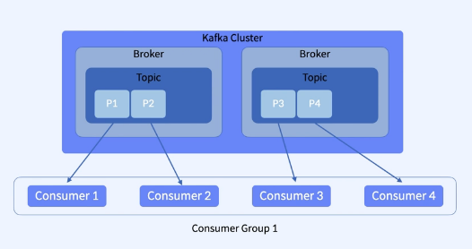
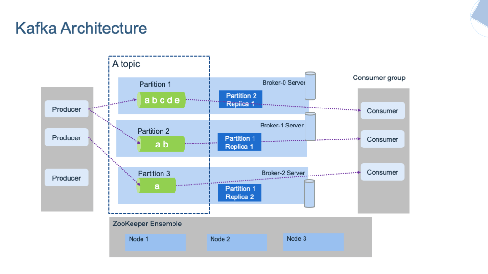

# 카프카 구성요소 (Kafka Architecture)

## **목차**
- [1. Topic이란?](#1)
- [2. Partition이란?](#2)
- [3. Message란?](#3)
- [4. Cluster](#4)
- [5. Producer](#5)
- [6. Consumer](#6)
- [7. Zookeeper](#7)

## 1. Topic이란? 

- `Topic`은 파티션의 그룹이라고 할 수 있다.
- `Topic`은 카프카 `데이터 스트림`이 어디에 `Publish`될지 정하는데 쓰인다.
- `Topic`은 파티션들을 모아두는 곳이라도 이해해도 좋다.
- `Producer`는 `Topic`을 지정하고 Message를 게시
- `Consumer`는 `Topic`을 지정하고 Message를 개시(POST)
- `Consumer`는 `Topic`으로부터 메시지를 받아옴. 카프카의 메시지는 디스크에 정렬되어 저장되며, 새로운 메시지가 도착하면 지속적으로 로그에 기록

## 2. Partition이란? 

- `Partition`은 요청하는 메시지들의 모임이라고 보면 된다.
- `Partition`마다 `commit log`가 따로 쌓인다.
- 모든 기록들은 `Offset`이라는 `ID`를 부여받는다. `Immutable(불변)` 속성을 갖는다.

## 3. Message란? 

- 카프카의 메시지는 `Byte`의 배열이다.
- `String, Json Avro`를 주로 사용한다.
- 메시지 크기에는 제한이 없지만, `KB바이트`에서 해결하기를 권장
- 데이터는 사용자가 지정한 시간만큼 저장(Retention Period)이 된다. 기간이 지나면 자동으로 삭제된다.
- 파티션에 들어가는 최소단위라 보면 좋음

### Topic, Partition, Message 처리방식

## 4. Cluster 

- 클러스터는 여러개의 카프카 브로커(서버)를 가질 수 있다.
- 토픽을 생성하면 모든 카프카 브로커에 생성된다.
- 파티션은 여러 브로커에 걸쳐서 생성된다.

- `Producer`가 메시지를 게시하면 `Round-Robin 방식`으로 파티션에 분배된다.(key를 지정하지 않을 때)
- 브로커는 `Replication Factor`를 조절할 수 있다. `Replication Factor`를 2로 지정하면 Topic에 나눠서 한번 씩 담기게 되는 구조를 가진다. 이 중에 한 브로커(서버)가 없어지더라도 완정히 서빙이 될 수 있게 하기 위함이다.
- `Replication Factor`를 설정하면 리더를 가진다. 그 리더를 중심으로 쓰기 읽기가 가능하다. 리더가 사라지면 다음 Broker가 받아서 리더가 된다.

## 5. Producer 

- 메시지를 토픽으로 보내는 역할을 한다.
- Producer는 카프카 토픽으로 메시지를 게시를 하는 클라이언트이다.
- 메시지를 어떻게 어디에 넣을지 정해준다.

## 6. Consumer 

- `Topic`에서 메시지를 가져와 소비하는 역할을 한다.
- `Consumer`를 생성할 때 모든 파티션에서 데이터를 받을 수 있다.
- `Consumer Group`은 모든 파티션에서 데이터를 받을 수 있다.
- `Consumer`는 지정된 파티션으로부터 데이터를 받을 수 있다.
- `Consumer`는 메시지를 소비할 때 리밸런싱을 하게 된다. 파티션 4가 남는 못브을 보이는데 `Consumer4`가 생성이 되면 리밸런싱 받아 파티션 4를 받게 된다.

## 7. Zookeeper 

- `Consumer`와 통신, 메타데이터 정보 저장, 카프카 상태관리를 해주는 툴이라고 보면된다.
- 클러스터 관리 - 클러스터에 존재하는 브로커를 관리하고 모니터링
- Topic 관리 - 토픽 리스트를 관리
- 파티션 리더 관리 - Replication Factor 관리
- 브로커들 끼리 서로 발견할 수 있도록 정보 전달

> 출처 : https://magpienote.tistory.com/212