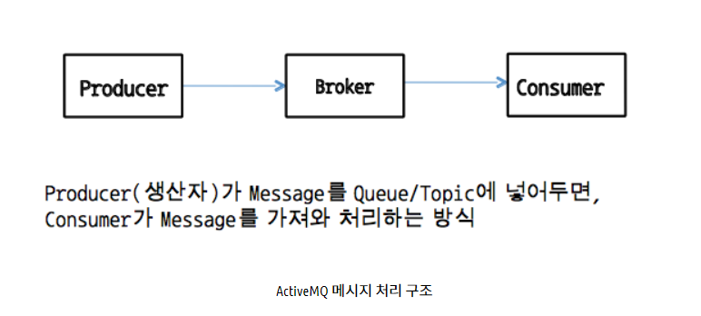
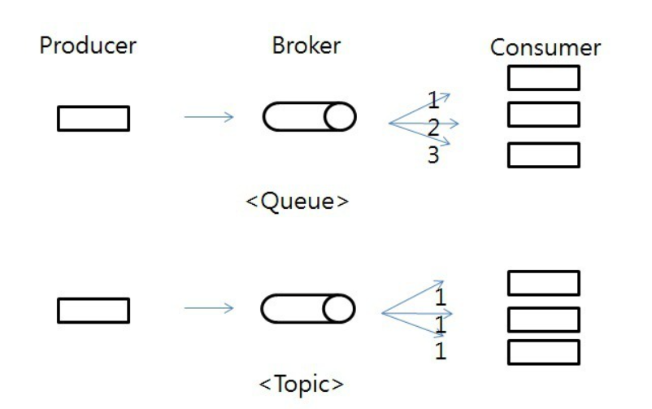

# ActiveMQ

## **목차**
- [1. ActiveMQ란?](#1)
- [2. JMS란?](#2)
- [3. ActiveMQ 메시지 처리 구조](#3)
- [4. ActiveMQ의 장점](#4)

## 1. ActiveMQ란? 
- Apache ActiveMQ는 가장 대중적이고 강력한 오픈 소스 메세징 그리고 통합 패턴 서버다.
- ActiveMQ는 JMS를 지원하는 클라이언트를 포함하는 브로커, 자바 뿐만 아니라 다양한 언어를 이용하는 시스템간의 통신을 할 수 있게 해준다. 또한 클러스터링기능 및 DB 그리고 FileSystem을 통해 각 시스템간의 일관성 및 지속성을 유지 시켜준다.
- ActiveMQ는 자바로 만든 오픈소스 메시지 브로커이다. JMS 1.1을 통해 자바 뿐만 아니라 다른 언어를 사용하는 클라이언트를 지원한다.
- 간단히 정의하면 클라이언트 간 메시지를 송수신 할 수 있는 오픈 소스 Broket(JMS 서버)다.

 
 

## 2. JMS란? 
- JMS는 자바 기반의 MOM(메시지 지향 미들웨어) API이며 둘 이상의 클라이언트 간의 메시지를 보낸다.

- JMS는 자바 플랫폼, 엔터프라이즈 에디션(EE) 기반이며, 메시지 생성, 송수신, 읽기를 수행하며 비동기적이며 신뢰할 만하고 느슨하게 연결된 서로 다른 분산 어플리케이션 컴포넌트 간의 통신을 허용한다.

- JMS의 핵심 개념은 Message Broker 와 Destination 이다.
    - **Message Broker** : 목적지에 안전하게 메시지를 건네주는 중개자 역할
    - **Destination** : 목적지에 배달될 2가지 메시지 모델 Queue, Topic
    - **Queue** : 메시지를 받기 위해 Consumer간 경쟁, 연결된 순서대로 메시지 제공
    - **Topic** : Pub/Sub 모델, 구독자 모두에게 메시지를 제공

**JMS 메시지 구조**
- 헤더, 등록정보, 본문 3가지 부문으로 구성된다.
- 헤더
    - JMS 메시지 필수 값, 메시지 경로 지정 및 식별에 사용되는 값 포함
- 등록 정보
    - 등록정보 이름, 등록정보 값의 쌍으로 지정
    - 데이터를 작성한 프로세스에 대한 정보, 데이터가 작성된 시간, 데이터 각 부분의 구조 포함 가능
- 본문 유형

|유형|설명|  
|---|-----|
|StreamMessage|본문이 Java 프리미티브 값의 스트림을 포함하는 메시지. 이 메시지는 순차적으로 채워지고 읽혀진다.|
|MapMessage|본문에 일련의 이름-값 쌍을 포함하는 메시지. 항목 순서는 정의되지 않는다.|
|TextMessage|본문에 Java 문자열을 포함하는 메시지, 예를들어 XML 메시지|
|ObjectMessage|본문에 일련화된 Java 객체를 포함하는 메시지|
|BytesMessage|본문에 해석되지 않은 바이트의 스트림이 포함된 메시지|

 

**JMS API 구현 순서**  
**ConnectionFactory -> Connections -> Session -> MessageProducer -> send**

 
 

## 3. ActiveMQ 메시지 처리 구조 

- 기본적으로 Message를 생성하는 Producer, ActiveMQ, Broker(Server), Message를 소비하는 Consumer로 구성되어 있다.

- QUEUE 모델의 경우 메시지를 받는 Consumer가 다수일 때 연결된 순서로 메시지는 제공된다.
- TOPIC 모델의 경우 메시지를 받는 Consumer가 다수일 때 메시지는 모두에게 제공된다.

 

## 4. ActiveMQ의 장점 
- **분리**
    - 대기열은 시스템 사이에 있으며, 하나의 시스템 장애는 다른 대기열에 영향을 주지 않는다. 메세지 통신은 대기열을 통해 이루어진다.
    - 시스템이 가동 중일때도 계속 작동한다.
    - ( 클라이언트와 서버간의 연결과 QUEUE 대기열의 역할이 분리 )
- **복구 지원**
    - QUEUE의 처리가 실패하면 나중에 메세지를 복원할 수 있다.
- **신뢰성**
    - 클라이언트 요청을 처리하는 시스템을 생각해보자. 정상적인 경우 시스템은 분당 100건의 요청을 받고 이 시스템 요청 수가 평균을 넘어서는 경우 신뢰할 수 없다. 이 경우 QUEUE는 요청을 관리할 수 있으며 시스템 처리량을 기초로 주기적으로 메세지를 전달할 수 있다.
    - QUEUE에서 들어온 메세지에 대한 처리를 관리하기 때문에 신뢰할 수 있는 시스템
- **비동기식 처리**
    - 클라이언트와 서버 통신이 비 차단되어있다.
    - 클라이언트가 서버에 요청을 보내면 응답을 기다리지 않고 다른 작업을 수행할 수 있다. 응답을 받으면 클라이언트는 언제든지 처리할 수 있다.

    다양한 언어와 프로토콜 지원 (Java, C, C++, C#, Ruby, Perl, Python, PHP클라이언트 지원)

- OpenWire를 통해 고성능의 Java, C, C++, C# 클라이언트 지원

- Stomp를 통해 C, Ruby, Perl, Python, PHP 클라이언트가 다른 인기있는 메시지 브로커들과 마찬가지로 ActiveMQ에 접근 가능

- Message Groups, Virtual Destinations, Wildcards와 Composite Destination를 지원

- Spring 지원으로 ActiveMQ는 Spring Application에 매우 쉽게 임베딩될 수 있으며, Spring의 XML 설정 메커니즘에 의해 쉽게 설정 가능
- Geronimo, JBoss 4, GlassFish, WebLogic과 같은 인기있는 J2EE 서버들과 함께 테스트됨

- 고성능의 저널을 사용할 때에 JDBC를 사용하여 매우 빠른 Persistence를 지원

- REST API를 통해 웹기반 메시징 API를 지원

- 웹 브라우저가 메시징 도구가 될 수 있도록, Ajax를 통해 순수한 DHTML을 사용한 웹 스트리밍 지원