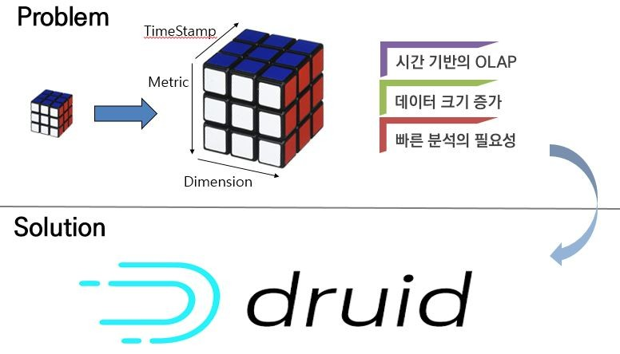
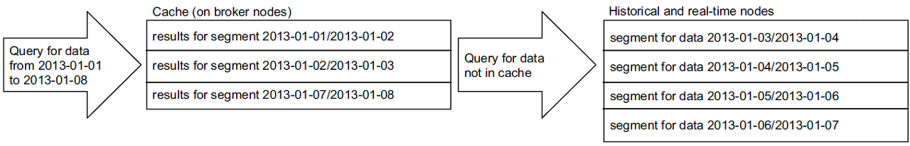

# Apache Druid



## **목차**
- [1. Apache Druid란?](#1)
- [2. Storage: Segment](#2)
    - [2-1. 데이터 수집(Ingestion)](#2-1)
    - [2-2. 데이터 Roll-up](#2-2)
    - [2-3. 데이터 저장 포맷](#2-3)
- [3. Druid Architecture](#3)
- [4. Historical: Loading and Serving Segments](#4)
    - [4-1. Loading and Serving Segments From Cache](#4-1)
- [5. Broker](#5)
    - [5-1. Caching](#5-1)
- [6. Coordinator](#6)
- [7. Indexing Service](#7)
    - [7-1. Overload](#7-1)
    - [7-2. MiddleManager](#7-2)
    - [7-3. Peons](#7-3)
- [8. Dependencies](#8)
    - [8-1. Metadata Storage(MySQL)](#8-1)
    - [8-2. Zookeeper](#8-2)
- [9. 추가적인 내용](#9)
    - [9-1. Router](#9-1)


## 1. Apache Druid란? <a id="1"></a>
> Apache Druid is a high performance real-time analytics database.

대규모 데이터 세트에 대한 **`빠른 분석을 위해 설계된 실시간 분석 데이터베이스`** 이다. Druid는 실시간 수집, 빠른 쿼리 성능을 위해 사용되며 빠른 집계가 필요한 동시성이 높은 API 백엔드로 사용된다.

Apache Druid는 OLAP 데이터베이스이다. OLAP는 `Online Analytics Processing`의 약자로 사용자가 적재한 데이터를 다양한 방식(다차원)으로 적재하고 분석하도록 도와주는 시스템이다. 다차원 정보는 기존에 1차원 정보(row 단위)를 몇 개의 필드들을 사용해서 지표로 만드렁 보여주는 것이다. 즉, Druid는 다차원 필드인 디멘션을 사용하여 메트릭을 만들어 보여준다.


- Timestamp : **모든 쿼리가 시간 축을 중심으로** 이루어지도록 한다. 만약 시간축이 없는 데이터를 ingestion하려고 하면 현재 시간을 기준으로 timestamp 컬럼이 채워진다.
- Dimension : 각 이벤트의 **문자열 속성**을 담고 있으며, 데이터를 필터링해야 하는 경우에 종종 사용된다. 이러한 차원 컬럼들을 축으로 데이터 slice 할 수 있다.
- Metric : **연산에 주로 활용**된다. 계수, 합산, 평균 등을 집계할 수 있다.

아파치 드루이드는 다차원 데이터를 빠른 쿼리로 제공하기 위해 **`세그먼트 단위로 데이터를 인덱싱하여 저장`** 한다. 세그먼트를 만드는 것은 time interval 단위이며 쿼리 수행이 아닌 데이터를 적재할 때 함께 인덱싱한다.  
-> 데이터는 분석하기 좋은 형태로 저장된다.

Dimension은 filter/group by가 가능한 필드이며 Metric은 수치 데이터로 timestamp에 따라 pre-aggregation/post-aggregation이 가능하다.

이러한 특징으로 드루이드는 전통적인 데이터베이스에 비해 쿼리시간이 엄청나게 빠르다는 장점을 가진다. 드루이드는 미리 디멘션을 지정하면 데이터가 유입될 때마다 인덱싱이 일어ㅏ므로 데이터를 빠르게 취합하고 결과를 얻을 수 있다.

하지만 드루이드는 정확한 값을 가져와야 할 때 사용하는 것은 적절하지 않다. 전체적인 지표의 흐름을 알기 위해 사용하기는 좋지만 정확한 값을 위해 사용하는 것은 권장하지 않는다. 또한 데이터를 검색하는데 특화되어 있지 않고 `적재된 데이터를 업데이트할 수 없다.` 그러므로 업데이트가 빈번히 일어나거나 일부 단어를 검색하는 용도로 사용하는 것 또한 적절하지 않다. 또한 데이터의 조인도 불가능하다.


## 2. Storage: Segment <a id="2"></a>
> Druid는 **`시간별로 분할된 세그먼트 파일에 인덱스를 저장`** 한다. 기본설정으로는 각 시간 간격마다 하나의 세그먼트 파일이 생성된다. heavy query load인 상태에서는 드루이드가 잘 작동하기 위해 세그먼트 파일의 크기가 300MB~700MB 내에 있는 것을 권장한다. 이 범위보다 크면 시간 간격을 더 세분화하거나 데이터를 파티셔닝하고 PartitionSize를 조정하는 것이 좋다.

Druid는 시계열 정보를 가진 데이터를 여러 shard로 나누어 분할 저장되며 이를 segment라고 부른다. 보통 1개의 세그먼트는 500~1000만개의 row로 이루어진다. Druid는 시계열 정보로 데이터를 분할하고 데이터 크기가 너무 크거나 작으면 그 외에 다른 컬럼들을 기준으로 추가 분할을 진행하여 segment의 크기를 적절하게 조절한다.

세그먼트는 Druid의 기본 저장 단위이다. 클러스터 내 데이터 복제 및 분산은 모두 segment 단위로 이루어진다. segment 데이터는 변경될 수 없으며 읽기/쓰기 동작 시에 경합이 발생하지 않는다. 따라서 `segment는 데이터를 빠르게 읽기 위한 전용 데이터 셋`이다.
또한, 세그먼트 분할은 병렬 처리를 위한 핵심 역할을 가진다. 여러 세그먼트에 여러 CPU가 동시에 `병렬적으로 데이터를 스캔`하기 때문에 쿼리 결과를 신속하게 반환할 수 있다.

기본적으로 columnar인 세그먼트 파일의 내부 구조를 설명하면, 각 column 데이터는 별도의 데이터 구조로 배치된다. Druid는 각 column을 별도로 저장하여 쿼리에 필요한 column만 검색함으로써 쿼리 시간을 줄인다. timestamp, dimension 및 metric columns의 세가지 유형이 있다.


**Timestamp, Metrics columns**는 단순하다. 각 column 뒤에는 LZ4로 압축된 정수 또는 부동 소수점 값의 배열이 있다. 쿼리가 선택해야 하는 column을 알면 해당 column을 압축 해제하고 추출한 다음 원하는 집계 연산자를 적용하기만 하면 된다. 쿼리에 필요하지 않은 column은 스킵한다.

**Demension(차원) columns**는 필터 및 그룹별 작업을 지원하므로 서로 다르다. 따라서 세 가지 데이터 구조가 필요하다.

1) 문자열로 처리되는 value를 정수 ID에 매핑하는 Dictionary
```json
1: Dictionary that encodes column values
{
    "Justin Bieber": 0,
    "ke$ha" :        1
}
```
<br/>

2) 1)에서 생성된 Dictionary를 사용하여 인코딩된 columns의 value list
```json
2: Column data
[0,
 0,
 1,
 1]
```
<br/>

3) column의 고유 값에 대해 해당 값을 포함하는 rows를 나타내는 bitmap
```json
3: Bitmaps - one for each unique value of the column
    value="justin Bieber": [1,1,0,0]
    value="ke$ha":         [0,0,1,1]
```

<br/>
<br/>

***Segment 관련 더 많은 내용은 <a href="https://druid.apache.org/docs/0.13.0-incubating/design/segments.html">링크</a> 참고**

## 2-1. 데이터 수집(Ingestion) <a id="2-1"></a>
Druid에 데이터를 로드하는 것을 ingestion 또는 indexing이라 한다. Druid로 데이터를 수집할 때, Druid는 소스 시스템에서 데이터를 읽고 `세그먼트`라는 데이터 파일에 저장한다. 일반적으로 세그먼트 파일에는 수만개의 행이 포함된다.

대부분의 수집은 Druid MiddleManager process 또는 Indexer process가 소스 데이터를 로드한다. 유일한 예외는 Hadoop 기반 수집인데, YARN에서 Hadoop MapReduce 작업을 사용한다.

Druid는 batch와 real-time 데이터 수집을 지원한다.
1) batch
    - 수집하는 동안(During ingestion) Druid는 세그먼트를 생성하고 이를 딥 스토리지에 저장한다. `히스토리컬 노드는 쿼리에 응답하기 위해 세그먼트를 메모리에 로드한다.`
2) real-time
    - 스트리밍 수집의 경우, `미들 매니저와 인덱서는 실시간으로 유입되는 데이터로 바로 쿼리에 응답`할 수 있다.

실시간 데이터 수집(ingestion)을 위해 real-time Node가 있으며, 이 노드에 저장되는 데이터 스트림 내 이벤트들은 수초 이내에 Druid 클러스터에 쿼리가 가능한 포맷으로 인덱싱된다.   
**`* 현재 real-time Node는 deprecated 됐으며, kafka indexing service로 전환되었다.`**

***Ingestion 관련 더 많은 내용은 <a href="https://druid.apache.org/docs/latest/ingestion/index.html">링크</a> 참고**

<br/>
<br/>

## 2-2. 데이터 ROll-Up <a id="2-2"></a>
Druid는 수집 단계에서 데이터를 롤업하여 디스크에 저장할 raw 데이터의 양을 줄일 수 있다. 롤업은 요약이나 사전집계(pre-aggregation)의 한 종류이다. 데이터를 롤업하면 저장할 데이터의 크기를 줄이고 row 수를 크게는 몇 배까지 줄일 수 있다. 롤업의 효용성에 대한 대가로(trade-off) 개별 이벤트들에 대한 쿼리를 날릴 수 없다.

timestamp 단위로 rollup을 진행하면 아래와 같은 결과를 얻을 수 있다. 그 시간에 어떤 이벤트가 발생했는지보다 시간대별 발생횟수가 필요한 상황에는 필요 없는 모든 데이터를 저장하지 않고 count라는 metric 컬럼을 사용하여 통합하여 저장한다.  
rollup은 원천 데이터 저장 용량을 최소화시켜 스토리지에 대한 리소스를 절약하며 쿼리속도를 빠르게 할 수 있다.


수집 시 'granularitySpec'.'rollup' 설정으로 롤업을 조절한다. 롤업은 기본적으로 활성화 되어있다. 즉, Druid는 'granularitySpec'.'queryGranularity' 설정 기반으로 dimension과 timestamp 같이 동일한 모든행을 단일행으로 결합한다.

<br/>
설정예시)

```json
"granularitySpec": {
  "segmentGranularity": "day",
  "queryGranularity": "none",
  "intervals": [
    "2013-08-31/2013-09-01"
  ],
  "rollup": true
}
```

롤업을 비활성화하면 Druid는 각 행을 있는 그대로 로드한다. 비활성화 모드는 롤업 기능을 지원하지 않는 데이터베이스와 유사하다.

> 참고)  
> queryGranularity 옵션에 대해 살펴보면, 이 옵션은 **세그먼트 내 타임스탬프 보관의 세부 단위**이다. 이 값은 세그먼트 단위와 같거나 더 상세해야한다. 쿼리할 수 있는 가장 작은 단위이며 '분' 단위로 지정했다면 분의 배수(5분, 10분, 시간)로도 쿼리가 가능하다.  
> 여러 단위를 입력할 수 있다. 타임스탬프를 자르지않고 그대로 저장하려면 'None'으로 설정한다.  

<br/>
<br/>

## 2-3. 데이터 저장 포맷 <a id="2-3"></a>
데이터를 저장하는 방식은 Durid를 분석 쿼리에 최적화하는 핵심 요소 중 하나이다.  
Druid는 컬럼 기반으로 데이터를 저장한다. 컬럼 기반으로 데이터를 저장하면 압축률이 높아지므로 스토리지 리소스를 줄일 수 있고 이벤트 스트림을 집계하는 과정에서 특정 컬럼만 사용하기 때문에 CPU 리소스를 줄일 수 있다. Column에는 비슷한 데이터가 모여 있을 확률이 높기 떄문에 Dictionary Encoding과 같은 방법을 사용하여 스트링을 하나의 정수로 매핑할 수 있다면 데이터를 저장하는 리소스를 압축할 수도 있다.

<br/>
<br/>

## 3. Druid Architecture <a id="3"></a>
**`<Summary>`**  
들어오는 데이터는 크게 Streaming, Batch Data로 나눌 수 있다.  
Streaming Data -> Kafka(Real-time Nodes)  
Batch Data -> HDFS(Deep Storage)  

HistoricalNodes는 Deep Storage인 HDFS에 저장된 세그먼트를 다운로드 한다.   
HistoricalNodes에 저장된 세그먼트를 BrokerNodes가 쿼리를 통해 조회한다.


(아래 그림은 생략된 부분들이 있기에 간단하게 2가지로 데이터가 나뉘는 것만 참고)


<br/>

공식 홈페이지에서 제공하는 Driud Architecture는 다음과 같다.


- **Coorinator** : service manages data availability on the cluster.
- **Overlord** : service controls the assignment of data ingestion workloads.
- **Broker** : handle queries from external clients.
- **Router** : services are optional; they route requests to Brokers, Coordinators, and Overlords.
- **Historical** : services store queryable data
- **MiddleManage** : services ingest data.

<br/>

## 4. Historical : Loading and Serving Segments <a id="4"></a>
> Historical node는 Indexing Service에서 생성된 세그먼트(읽기 전용 데이터 블록)을 로드하고 처리한다.

각 historical node는 Zookeeper와 지속적인 연결을 유지하고 새로운 segment 들의 경로와 같은 정보를 확인한다. historical node는 서로 직접 통신하거나 코디네이터 노드와 통신하지 않고 Zookeeper에 의존한다.

Coordinator node는 새로운 세그먼트를 historical node에 할당하는 역할을 한다. 할당은 historical node와 연결된 load queue 경로에 임시 Zookeeper 항목을 생성하는 것으로 수행한다.   
* (coordinator가 historical node에 세그먼트를 할당하는 자세한 방법은 아래 coordinator에서 설명)

Historical node가 load queue 경로에서 새로운 항목을 발견하면 먼저 로컬 디스크 디렉토리(cache)에서 세그먼트에 대한 정보를 확인한다. 캐시에 세그먼트에 대한 정보가 없는 경우 historical node는 zookeeper에서 새로운 세그먼트에 대한 메타데이터를 다운로드한다. 이 메타데이터는 세그먼트가 deep-storage 내에 어디에 있는지, 세그먼트의 압축을 풀고 처리하는 방법에 대한 정보들이 있다.

historical node가 세그먼트 처리를 완료하면 node 내에 저장된 세그먼트는 zookeeper에 알려진다.**`(announced)`**  
이 시점부터 세그먼트는 쿼리에 사용될 수 있다.


## 4-1. Loading and Serving Segments From Cache<a id="4-1"></a>
캐시에서 세그먼트를 로드하고 제공한다. Historical node가 load queue에서 새로운 세그먼트를 감지하면, historical node는 먼저 로컬 디스크에서 구성 가능한 캐시 디렉토리를 확인하여 세그먼트가 이전에 로드되었는지 확인한다. 로컬 캐시가 이미 있는 경우 historical node는 로컬 디스크에서 세그먼트 binary 파일을 읽고 세그먼트를 로그한다.

세그먼트 캐시는 historical node가 처음 시작될 때 활용된다. 시작 시 historical node는 캐시 디렉토리를 검색하고 발견된 모든 세그먼트를 즉시 로드하고 제공한다. 이 기능을 사용하면 historical node가 online이 되는 즉시 쿼리가 가능하다.

---

Historical node군은 Indexing Service에서 생성된 세그먼트(읽기 전용 데이터 블록)을 로드하고 처리한다. 이 노드들은 딥 스토리지에서 세그먼트를 다운로드하고 이에 대한 쿼리를 처리한다. 단순히 Zookeeper의 지시에 따라 세그먼트를 로드, 드롭 처리한다.  
Historical Node가 쿼리를 처리하는 프로세스는 아래와 같다.


쿼리를 받은 Historical 노드는 먼저 `로컬 캐시`를 확인한다. 세그먼트에 관한 정보가 캐싱되어 있지 않으면 `딥 스토리지에서 해당 세그먼트를 다운로드`한다. 이렇게 되면 해당 세그먼트는 `Zookeeper에서 선언되어 쿼리 가능한 대상`이 되며, 노드는 이 세그먼트에 대해 요청된 쿼리를 수행한다.  
Historical 노드는 읽기 전용 데이터만을 다루므로 read consistency를 보장할 수 있다. 따라서 Historical 노드들은 읽기 전용 데이터 블록들을 동시에 스캔, 집계할 수 있다.   
historical 노드들은 자신들의 온라인 상태와 처리중인 데이터를 Zookeeper에 보고한다.

<br/>

## 5. Broker<a id="5"></a>
> Broker는 분산 클러스터를 실행하려는 경우 **`쿼리를 라우팅하는 노드`** 이다. 어떤 노드에 어떤 세그먼트가 있는지에 대한 정보를 Zookeeper의 메타데이터로 확인하고, 올바른 노드에 도달할 수 있도록 쿼리를 라우팅한다. 그리고 모든 개별 프로세스의 결과 집합을 merge한다.

대부분의 Druid 쿼리에는 데이터가 요청되는 기간을 나타내는 'interval object'가 포함되어 있다. 마찬가지로, 드루이드 세그먼트는 일정 기간의 데이터를 포함하도록 분할되어 있으며, 각각의 세그먼트는 클러스터에 분산되어 있다.

만약, 각 세그먼트가 특정 요일의 데이터를 포함하는 7개(월~일)의 세그먼트로 나뉘어져 있다면, 하루 이상의 데이터를 조회하는 쿼리는 둘 이상의 세그먼트를 사용해야 한다. 이렇게 되면 세그먼트는 여러 노드에 분산되어 있으므로 쿼리도 여러 노드에 분산될 수 있다.

**`Zookeeper에 보고된 메타데이터를 통해 어떤 세그먼트들을 사용해서 쿼리가 가능한지, 이 세그먼트들이 어디에 저장되어 있는지를 파악해야한다.`** zookeeper의 정보를 기반으로 view of the world(월드뷰)를 작성한다. zookeeper는 historical 및 Realtime 노드와 각 노드들이 서비스중인 세드먼트에 대한 정보를 유지관리한다.

* zookeeper의 모든 데이터 소스에 대해 broker node는 세그먼트와 해당 세그먼트를 가진 노드의 timeline을 구축한다. 특정 데이터 소스 및 간격(interval)에 대한 쿼리가 들어오면 timeline을 확인해서 쿼리에 대한 데이터가 포함된 노드를 검색한다. 그리고 broker node는 선택한 노드로 쿼리를 전달한다.

Broker노드는 입력된 쿼리들의 route를 지정함으로써 각 쿼리가 올바른 historical or realtime 노드에 도달되게끔 한다.  
그리고 historical or realtime 노드에서 산출된 결과들을 취합하여 최종 쿼리 결과를 호출자에게 반환한다.

## 5-1. Caching<a id="5-1"></a>
**`Broker Node`** 는 리소스 효율성을 높이기 위해 캐시를 사용한다.  
broker cache는 각 세그먼트의 결과를 저장한다. 캐시는 각 broker node의 local에 저장하거나 여러 노드에서 공유하기 위해 memcached와 같은 외부 분산 캐시를 사용할 수도 있다.

브로커 노드는 쿼리를 수신할 때마다 세그먼트 집합에 쿼리를 매핑한다. 캐시에 이미 있는 경우 결과를 캐시에서 직접 가져올 수 있으며, 캐시에 없는 경우 브로커 노드가 쿼리를 historical node로 전달한다. historical node가 결과를 반환하면 broker는 결과를 캐시에 저장한다.



유입된 쿼리가 여러 세그먼트를 사용해야 할 경우 broker 노드는 캐시에 이미 존재하는 세그먼트들을 우선적으로 확인한다. 그리고 캐시에 없는 세그먼트들에 대해서 해당 세그먼트가 포함된 historical or realtime 노드로 쿼리를 전달한다.  
historical 노드들이 결과를 반환하면, broker 노드는 이 결과를 나중에 사용할 수 있도록 세그먼트별로 캐시에 저장한다.  
참고로,   
* 실시간 세그먼트는 캐시되지 않으므로 실시간 데이터 요청은 항상 실시간 노드로 전달된다.
* 실시간 데이터는 지속적으로 변경되기 때문에 결과를 캐싱하게되면 신뢰도가 떨어진다.

<br/>
<br/>

## 6. Coordinator<a id="6"></a>
> Druid coorinator node는 configuration에 따라 세그먼트를 로드하거나 삭제하기 위해 historical node와 통신한다. Druid coordinator는 새로운 세그먼트 로드, 오래된 세그먼트 삭제, 세그먼트 복제 관리 및 세그먼트 로드 밸런싱을 담당한다.

Druid coordinator는 주기적으로 실행되며 이 주기는 설정 값으로 변경이 가능하다. Druid coordinator는 실행될 때마다 작업 전에 클러스터의 현재 상태를 확인한다. broker, historical node와 마찬가지로 현재 클러스터 정보를 알기위해 zookeeper 클러스터에 대한 연결을 유지한다.

Druid coordinator node는 주로 세그먼트 관리와 분배 역할을 수행한다. 더 상세하게 말하면, 코디네이터 노드는 구성에 따라 (based on configurations) `세그먼트를 로드하거나 drop하기 위해 historical nodes와 커뮤니케이션`한다.

-> historical node 데이터의 관리 및 분산을 담당한다.
- Druid coordinator는 새로운 세그먼트들을 로드하고, 오래된 세그먼트를 drop하며, 세그먼트 복제 관리 및 세그먼트 로드밸런싱을 담당한다.
- Druid coordinator는 주기적으로 실행되며 각각의 수행 사이의 시간은 설정 파라미터로 변경 가능하다.
- Druid coordinator는 실행될 때마다 적절한 action을 결정하기 전에 클러스터의 현재 상태를 체크한다. broker, historical nodes와 비슷하게 Druid coordinator는 현재 클러스터의 정보를 얻기 위해 zookeeper 클러스터에 대한 연결을 유지한다.

또한, coodinator는 사용가능한 세그먼트와 rules 정보가 있는 `데이터베이스에 대한 연결을 유지`한다. (coordinator는 MySQL 서버에 접속한다.)  
사용 가능한 세그먼트는 세그먼트 테이블에 저장되고 클러스터에 로드되어야하는 모든 세그먼트가 나열된다. Rule은 rule 테이블에 저장되며 세그먼트를 처리하는 방법을 나타낸다.

할당되지 않은 세그먼트를 historical nodes에서 처리하기 전에 각 계층에서 사용 가능한 historical nodes를 용량별로 정렬한다. 이때, 최소 용량 서버는 가장 높은 우선 순위를 가진다.  
할당되지 않은 세그먼트는 항상 최소 용량 노드에 할달되어 노드 간 균형 수준을 유지한다. coordinator는 새로운 세그먼트를 할당할 때 historical nodes와 직접 통신하지 않으며, 대신 historical 노드의 로드 큐 경로에 새로운 세그먼트에 대한 임시 정보를 저장한다. 이 요청이 표시되면 historical 노드가 세그먼트를 load하고 서비스를 시작한다.

***Coodinator 관련 더 많은 내용은 <a href="https://druid.apache.org/docs/0.13.0-incubating/design/coordinator.html">링크</a> 참고**

