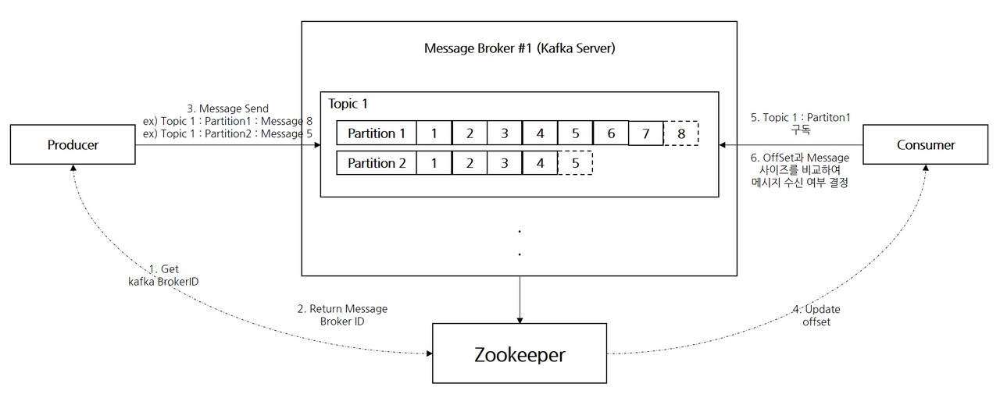
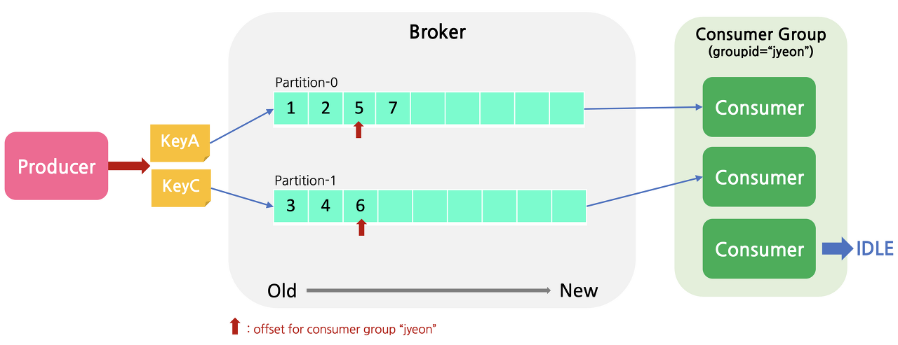
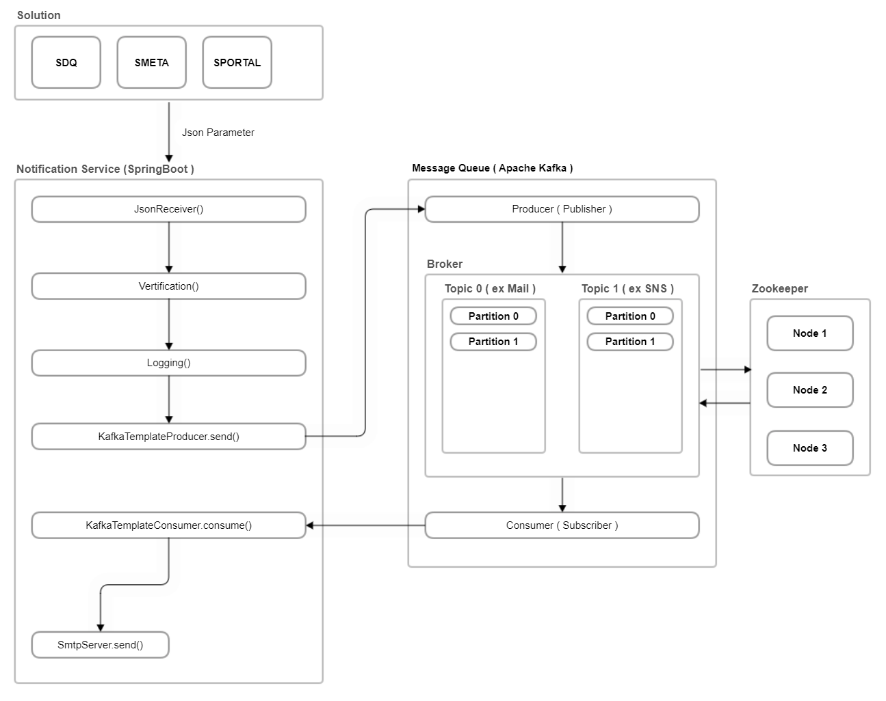

# Notification Service

Version - 

Message Queue : Apache Kafka 3.2.0

SpringBoot : 

Gradle : 

Java : 11


> Message Queue : https://github.com/dongkii/Self-Improvement/blob/master/2023-05-26_Message_Queue.md
>
> Apache Kafka 기본 설명 : https://github.com/dongkii/Self-Improvement/blob/master/2023-05-30_Apache_Kafka.md
>
> Apache Kafka 구성 요소 : https://github.com/dongkii/Self-Improvement/blob/master/2023-05-31_Kafka_Architecture.md
>
> Kafka 도입 사례 : https://colevelup.tistory.com/16

<br/>

```
- 각 솔루션에서 필요한 알림 기능을 서비스하기 위해 독립적인 서비스가 필요 - 알림서비스의 문제발생 시 SDQ 까지 배포해야 하는 상황이 발생하지 않도록 독립적인 인스턴스로 진행
- 기본적인 알림기능은 SDQ의 진단 결과에 따른 메일서비스부터 시작
- MQ를 통해 데이터 처리
```


## Kafka
아파치 카프카(Apache Kafka)는 `분산 스트리밍 플랫폼`이며 데이터 파이프 라인을 만들 때 주로 사용되는 오픈소스 솔루션이다.  
카프카는 대용량의 실시간 로그처리에 특화되어 있는 솔루션이며 데이터를 유실없이 안전하게 전달하는 것이 주 목적인 메시지 시스템에서 **Fault_Tolerant** 한 안정적인 아키텍처와 빠른 퍼포먼스로 데이터를 처리할 수 있다.

<br/>
<br/>

## Kafka 선정이유

분산처리 시스템에서 많이 사용되는 오픈소스 솔루션이며, Scale-out에서 자유롭고, 데이터가 메모리 큐에 적재하는 다른 MQ와는 달리 디스크에 순차적으로 저장하기 때문에 빠른 속도, 데이터의 유실 걱정이 없다.

<br/>
<br/>

## Kafka 동작 방식



1. Producer는 Zookeeper로부터 메시지를 보낼 BrokerID를 요청
2. Zookeeper는 Producer에게 BrokerID를 리턴
3. Producer는 전달받은 BrokerID의 Partition Leader에 메시지를 전송
4. Partition Follow는 전송된 메시지를 전달하여 복제
5. Consumer는 누적된 Offset만큼 해당 Partition의 메시지를 구독
6. Zookeeper는 Consumer Group가 가져가야할 Offset을 업데이트하여 전달
7. Consumer Group은 Offset 값 증가시키면서 Partition Leader에서 메시지 읽어옴

- Partition 선택과 Partition 수 / Consumer 수 간의 관계


- Producer가 메시지를 전달할 때 key를 포함해서 전송할 수 있음.
    - key = NULL 이면, Partition을 선택하는 기준은 Round-robin 순서로 전송
    - key가 지정되어 있을 경우, 해당 key를 가지는 데이터는 항상 같은 Partition으로 보내짐
- 하나의 Partition에 대해 같은 Consumer Group 내 여러 Consumer가 이용할 수 없음.
    - Partition 한개당 하나의 Consumer Group 단위로 Offset을 관리하기 때문에 두 개 이상의 Consumer가 하나의 Partition의 메시지를 소비할 수는 없음
- Partition의 수 보다 Consumer의 수가 더 많을 경우, 할당 받지 못한 Consumer는 대기함.


<br/>
<br/>

## SpringBoot 데이터 수집 서비스 개발



기본적인 서비스 구조는 위와 같다.

- SDQ를 포함한 다른 솔루션에서 알림서비스API를 통해 JSON 데이터를 전달
- 알림서비스 내 검증 작업(값 검증, 화이트리스트 검증)
- 검증이 끝난 데이터에 대한 로깅 작업
- Kafka Producer에 데이터(Topic을 포함한) Send()
- Kafka에서 토픽에 따라 컨슈머 그룹 연결
- 알림서비스에서 consume()을 통해 큐(디스크)에 저장된 데이터 소비
- 소비된 데이터 메일 발송

<br/>
<br/>

확장이 가능한 부분
- 서비스의 확장
    - 카카오 알림톡, SNS 등
    - Topic분류를 통해 알림 서비스 분류 ( 속도 저하 X )
- 솔루션의 확장 - SDQ뿐만 아니라 다른 솔루션에서의 연결
    - 정해진 API규격에 따라 데이터 전달시 기존과 동일한 서비스 제공

