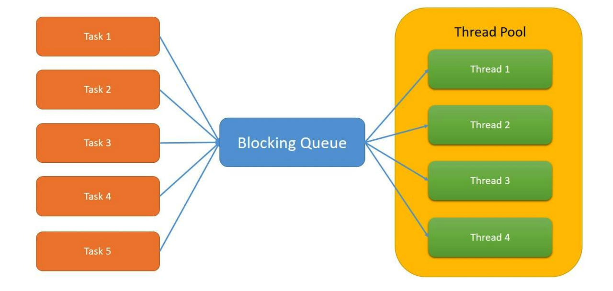

# ExecutorService 사용법

Thread를 구현할 때 Runnable 인터페이스를 구현하거나 Thread 클래스를 상속하여 구현한다. 구현한 Thread를 `new MyThread().start()` 와 같이 호출하여 직접적으로 실행할 수도 있지만 기본 JDK의 `java.util.concurrent` 패키지의 `ExecutorService` 를 이용하여 실행할 수도 있다.

---

> ## ExecutorService
`ExecutorService`는 재사용이 가능한 ThreadPool로 `Executor` 인터페이스를 확장하여 Thread의 라이프사이클을 제어한다.  
Thread를 활용하여 다수의 작업(Task)들을 비동기로 수행한다는 것은 간단하지 않다. **Thread의 라이프사이클(생성과 제거 등)이나 발생할 수 있는 여러가지 low level의 고려사항들이 존재하는데 이를 개발자가 신경쓰지 않도록 편리하게 추상화 한것이 `ExecutorService`이다.**  
`ExecutorService`에 Task(작업)를 지정해주면 가진 ThreadPool을 이용하여 Task를 실행한다. Task는 큐(Queue)로 관리되기 때문에 ThreadPool의 Thread 갯수보다 실행할 Task가 많은경우 미실행된 Task는 큐에 저장되어 실행을 마친 Thread가 생길 때까지 기다린다.



---

> ## ExecutorService 초기화

`ExecutorService`를 초기화하는 방법에는 2가지 방법이 있다.

## 1. 직접 new 키워드를 사용
`ExecutorService`는 인터페이스이기 때문에 구현체인 `ThreadPoolExecutor`를 new 키워드로 초기화한다. (필요에 따라 다른 구현체를 초기화해도 된다.)  
아래의 초기화 코드에서 10개의 core thread, 10개의 max thread, 0 밀리세크의 keepAliveTime, 작업큐로는 LinkedBlockingQueue가 초기화 되었다.  
Task(작업)을 위한 Queue에는 Runnable과 Callable 인터페이스를 구현한 클래스를 받을 수 있는데 return 값이 있냐(Callable) 없냐(Runnable)에 따라 선택하면 된다.

```java
ExecutorService executorService = new ThreadPoolExecutor(10, 10, 0L, TimeUnit.MILLISECONDS, new LinkedBlockingQueue());
```

## 2. Executors 클래스에서 제공하는 Factory method를 사용
제공되는 3가지의 factory method를 이용한 초기화이다. 메서드명에서 생성되는 ThreadPool의 성향을 유추할 수 있으며 실행하고자 하는 Task에 따라 선택하여 사용한다.

```java
// 1. 10개의 고정 사이즈의 ThreadPool 생성
ExecutorService executorService = Executors.newFixedThreadPool(10);

// 2. 1개 고정 사이즈의 ThreadPool 생성
ExecutorService executorService = Executors.newSingleThreadExecutor();

// 3. 유동적으로 증가하고 줄어드는 ThreadPool 생성
ExecutorService executorService - Executors.newCachedThreadPool();
```

new 키워드를 사용하는 것이 조금 더 세부적인 설정이 가능하지만 `Executors`를 사용하는 것이 더 간편하다. 대부분의 경우 간편한 설정으로 원하는 작업이 가능하다.

---

> ## ExecutorService Task 할당
`ExecutorService`를 초기화했다면 ThreadPool에 원하는 Task(작업)을 할당해야 한다. 일단 Task를 Callable/Runnable 인터페이스를 구현하여 생성하고, `ExecutorService`의 메서드를 호출하여 실행한다.

```java
// Runnable 인터페이스로 Task 정의
Runnable runnableTask = () -> {
    try {
        System.out.println(Thread.currentThread().getName() + " start");
        TimeUnit.MILLISECONDS.sleep(500);
        System.out.println(Thread.currentThread().getName() + " end");
    } catch(InterruptedException e) {
        e.printStackTrace();
    }
};

// Callable 인터페이스로 Task 정의
Callable callableTask = () -> {
    TimeUnit.MILLISECONDS.sleep(500);
    return "Task's execution";
};

// 정의한 Task를 List에 추가
List<Callable> callableTasks = new ArrayList<>();
callableTasks.add(callableTask);
callableTasks.add(callableTask);
callableTasks.add(callableTask);
```

아래는 위에서 정의한 작업(Task)을 할당(실행)하기 위해서 제공되는 메서드들이다.

1. execute() : 리턴타입이 void로 Task의 실행결과나 Task의 상태(실행중 or 실행완료)를 알 수 없다.
```java
executorService.execute(runnableTask);
```

<br/>

2. submit() : Task를 할당하고 `Future` 타입의 결과값을 받는다. 결과가 리턴되어야 하므로 주로 Callable을 구현한 Task를 인자로 준다.
```java
Future future = executorService.sumbit(callableTask);
```

<br/>

3. invokeAny() : Task를 Collection에 넣어서 인자로 넘겨줄 수 있다. 실행에 성공한 Task 중 하나의 리턴값을 반환한다.
```java
String result = executorService.invokeAny(callable);
```

<br/>

4. invokeAll() : Task를 Collection에 넣어서 인자로 넘겨줄 수 있다. 모든 Task의 리턴값을 `List<Future<>>` 타입으로 반환한다
```java
List<Future> futures = executorService.invokeAll(callableTasks);
```

---

> ## ExecutorService 종료
실행 명령한 Task가 모두 수행되어도 ExecutorService는 자동으로 종료되지 않는다. 앞으로 들어올 Task를 처리하기 위해 Thread는 wait 상태로 대기한다. 그러므로 종료를 위해서는 제공되는 shutdown() 이나 shutdownNow() API를 사용해야 한다.

1. executorService.shutdown()  
- 실행중인 모든 Task가 수행되면 종료한다.

2. List\<Runnable> notExecutedTasks = executorService.shutDownNow()
실행중인 Thread들을 즉시 종료시키려고 하지만 모든 Thread가 동시에 종료되는 것을 보장하지는 않고 실행되지 않은 Task를 반환한다.  
여기에 추가로 두 개의 shutdown 메소드가 결합된 awaitTermination()을 사용하는 것이 추천된다. 이 메서드는 먼저 새로운 Task가 실행되는 것을 막고, 일정 시간동안 실행중인 Task가 완료되기를 기다린다. 만일 일정 시간동안 처리되지 않은 Task에 대해서는 강제로 종료시킨다.

```java
executorService.shutdown();
try {
    if(!executorService.awaitTermination(800, TimeUnit.MILLISECODS)) {
        executorService.shutdownNow();
    }
} catch(InterruptedException e) {
    executorService.shutdownNow();
}
```

> ## Future 인터페이스
`submit()`과 `invokeAll()` 메서드를 호출할 때 반환하는 `Future` 객체로 Task의 결과값이나 상태(실행중 또는 실행완료)를 알 수 있다. 또한 `Future` 인터페이스는 Blocking method인 get() 을 제공하는데 Task 실행 결과를 얻을 수 있다. (Runnable을 구현한 Task라면 null이 반환된다.)  
Blocking이기 때문에 실행중에 get() 이 호출되는 경우 실행이 끝날 때까지 대기한다. 이는 성능저하를 불러올 수 있으므로 Timeout을 설정하여 일정 시간이 지나면 `TimeoutException`이 발생하도록 유도할 수 있다.

```java
Future<String> future = executorService.sumbit(callableTask);
String result = null;
try {
    result = future.get(); // Task가 실행중이면 여기서 대기한다.
} catch (InterruptedException | ExecutionException e) {
    e.printStackTrace();
}

// Timeout 설정, 지정된 시간이 지나면 TimeoutException이 발생한다.
String result = future.get(200, TimeUnit.MILLISECODS);
```

이 밖에도 `isDone()`, `cancel()`, `isCancelled()` 메서드가 있다.

```java
boolean isDone = future.isDone(); // Task가 실행되었는지?
boolean canceled = future.cancel(true); // Task를 취소
boolean isCancelled = future.isCancelled(); // Task가 취소되었는지?
```