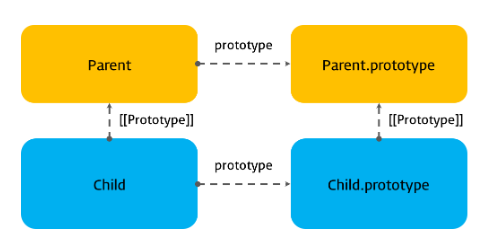
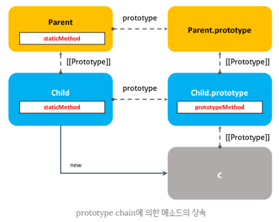

### ECMAScript6

1. let, const
- 변수는 let 을 사용하고 상수는 const를 사용
- let, const는 블록레벨스코프를 가짐   
`블록레벨스코프` : 함수 밖에서 선언 시 함수 스코프 변수처럼 전역접근이 가능하나, 블록 안에서 선언하면 자신을 정의한 블록과 하위 블록에서만 접근가능하다.   
let과 const모두 블록레벨 스코프로 **`재선언이 불가능`** 하고 const키워드는 읽기 전용 변수로 상수이기때문에 선언시에 초기화 하지않으면 사용 불가능

```js
let foo = true;
{
    let foo = 'a';
    console.log(foo);
}
console.log(foo);
```

<br/>

- 상수를 아래와 같은 경우 사용
    - 고정 값으로 값이 변경되면 안되는 경우
    - 프로그래밍의 가독성을 높혀줌
    - 고정 값이 변경되는 경우, 관리 및 변경이 용이함
    - 배열이나 객체의 주소값(레퍼런스)을 가지는 변수
```js
const MAX_USER_COUNT = 10;

const curUser = getUsers();
if(curUser.length < MAX_COUNT) {
    ...
}
```
<br/>
<br/>
<br/>
<br/>

### 객체 리터럴 단축 표기방식에 대해 알아보기 전 복습     

```js
console.log(foo);

var foo;
console.log(foo);

foo = 1;
console.log(foo);
```

```js
console.log(foo);

let foo;
console.log(foo);

foo = 1;
console.log(foo);
```

```js
console.log(foo);
var foo = 1;

console.log(bar);
let bar = 2;
```

```js
let foo = 1;

{
    console.log(foo);
    let foo = 2;
}
```

```js
let a = 0;
let a = 1;

if(true) {
    let b = 2;
    let b = 3;
    console.log(b);
}

console.log(a);
console.log(b);
```

```js
let foo = 123;

{
    let foo = 456;
    let bar = 789;
}

console.log(foo);
console.log(bar);
```


<br/>
<br/>
<br/>
<br/>


## 5. 객체 리터럴 프로퍼티 기능 확장

### 객체 프로퍼티 단축 표기 방식

ES5에서 객체 리터럴의 프로퍼티는 프로퍼티 이름과 프로퍼티 값으로 구성된다. 프로퍼티의 값은 변수에 할당된 값일 수도 있다.

```js
// ES5
var x = 1, y =2;

var obj = {
    x: x,
    y: y
};

console.log(obj); // { x: 1, y: 2 }
```

```js
// ES6
let x = 1, y = 2;

const obj = {
    x,
    y
};

console.log(obj); // { x: 1, y: 2}
```

<br/>

ES6 에서는 프로퍼티 값으로 변수를 사용하는 경우, 프로퍼티 이름을 생략(Property shorthand) 할 수 있다. 이 때 프로퍼티 이름은 변수의 이름으로 자동 생성된다.

```js
const [a, b] = [1, 2];
const obj = { a: a, b: b }
const obj2 = { a, b }; // same as { a: a, b: b }
// 프로퍼티 값과 이름이 같을때 생략 가능 
```

### 객체 메소드의 단축 표기 방식
- 메소드의 축약 표현이라고도 하며 ES5 와 ES6의 차이는 아래와 같다.

```js
// ES5
var obj = {
    name: 'Lee',
    sayHi: function() {
        console.log('Hi! ' + this.name);
    }
};

obj.sayHi(); // Hi! Lee
```

```js
// ES6
const obj = {
    name: 'Lee',
    sayHi() {
        console.log('Hi! ' + this.name);
    }
};

obj.sayHi(); // Hi! Lee
```

### 객체 내 [ ... ] 프로퍼티 지정 및 __proto__ 사용 가능
```js
let idx = 0;
const obj = {
    ['name_' + idx]: 'Lee'
};
```

문자열 또는 문자열로 변환 가능한 값을 반환하는 표현식을 사용해 프로퍼티 키를 동적으로 생성할 수 있다. 단, 프로퍼티 키로 사용할 표현식을 대괄호([...])로 묶어야 한다. 이를 계산된 프로퍼티 이름(Computed property name)이라 한다.

ES5에서 프로퍼티 키를 동적으로 생성하기 위해선 객체 리터럴 외부에서 대괄호([...]) 표기법을 사용해야 한다.

```js
// ES5
var prefix = 'prop';
var i = 0;

var obj = {};

obj[prefix + '-' + ++i] = i;
obj[prefix + '-' + ++i] = i;
obj[prefix + '-' + ++i] = i;

console.log(obj); // {prop-1: 1, prop-2: 2, prop-3: 3}
```

<br/>

ES6에서는 객체 리터럴 내부에서도 프로퍼티 키를 동적으로 생성할 수 있다.

```js
// ES6
const prefix = 'prop';
let i = 0;

const obj = {
    [`${prefix}-${++i}`]: i,
    [`${prefix}-${++i}`]: i,
    [`${prefix}-${++i}`]: i
};

console.log(obj); // {prop-1: 1, prop-2: 2, prop-3: 3}
```

<br/>

`__proto__` 프로퍼티에 의한 상속
ES5에서 객체 리터럴을 상속하기 위해선 Object.create() 함수를 사용한다. 이를 `프로토타입 패턴 상속`이라고 한다.

```js
// ES5
var parent = {
    name: 'company',
    sayHi: function() {
        console.log('Hi! ' + this.name);
    }
};

// 프로토 타입 패턴 상속
var child = Object.create(parent);
child.name = 'team';

parent.sayHi(); // Hi! company
child.sayHi(); // Hi! team
```

```js
// ES6
const parent = {
    name: 'company',
    sayHi() {
        console.log('Hi! ' + this.name);
    }
};

const child = {
    // child 객체의 프로토타입 객체에 parent 객체를 바인딩하여 상속을 구현한다.
    __proto__: parent,
    name: 'team'
};

parent.sayHi(); // Hi! company
child.sayHi(); // Hi! child
```

<br/>
<br/>
<br/>
<br/>

## Destructuring (비구조화)
### 1. 배열 디스트럭처링 (Array Destructuring)
```js
// ES5
var arr = [1, 2, 3];

var one = arr[0];
var two = arr[1];
var three = arr[2];

console.log(one, two, three); // 1 2 3
```

<br/>

ES6의 배열 디스트럭처링은 배열의 각 요소를 배열로부터 추출하여 변수 리스트에 할당한다. 이때 추출/할당 기준은 **`배열의 인덱스`** 이다.
```js
// ES6 Destructuring
const arr = [1, 2, 3];

// 배열의 인덱스를 기준으로 배열로부터 요소를 추출하여 변수에 할당
// 변수 one, two, three가 선언되고 arr(initializer(초기화자))가 Destructuring(비구조화, 파괴)되어 할당된다.
const [one, two, three] = arr;
// 디스트럭처링을 사용할 때는 반드시 initializer(초기화자)를 할당해야 한다.
// const [one, two, three]; // SyntaxError: Missing initalizer in destructuring declaration

console.log(one, two, three); // 1 2 3
```

<br/>

배열 디스트럭처링을 위해서는 할당 연산자 왼쪽에 배열 형태의 변수 리스트가 필요하다.
```js
let x, y, z;
[x, y, z] = [1, 2, 3];

// 위의 구문과 동치
let [x, y, z] = [1, 2, 3];
```

<br/>

왼쪽의 변수 리스트와 오른쪽의 배열은 배열의 인덱스를 기준으로 할당된다.

```js
let x, y, z;

[x, y] = [1, 2];
console.log(x, y); // 1 2

[x, y] = [1];
console.log(x, y); // 1 undefined

[x, y] = [1, 2, 3];
console.log(x, y); // 1 2

[x, , z] = [1, 2, 3];
console.log(x, z); // 1 3

// 기본값
[x, y, z = 3] = [1, 2];
console.log(x, y, z); // 1 2 3

[x, y = 10, z = 3] = [1, 2];
console.log(x, y, z); // 1 2 3

// spread 문법
[x, ... y] = [1, 2, 3];
console.log(x, y); // 1 [ 2, 3 ]
```

<br/>

ES6의 배열 디스트럭처링은 **`배열에서 필요한 요소만 추출하여 변수에 할당하고 싶은 경우에 유용`** 하다. 아래의 코드는 Date 객체에서 년도, 월, 일을 추출하는 예제이다.
```js
const today = new Date(); // Mon Mar 2 2024 20:17:45 GMT+0900 (한국 표준시)
const formattedDate = today.toISOString().substring(0, 10); // "2024-03-02"
const [year, month, day] = formattedDate.split('-');
console.log([year, month, day]); // [ '2024', '03', '02' ]
```

<br/>

### 2. 객체 디스트럭처링 (Object Destructuring)

ES5에서 객체의 각 프로퍼티를 객체로부터 디스트럭처링하여 변수에 할당하기 위해서는 프로퍼티 이름(키)을 사용해야 한다.
```js
// ES5
var obj = { firstname: 'DongKyun', lastName: 'Yang' };

var firstName = obj.firstName;
var lastName = obj.lastName;

console.log(firstName, lastName); // Dongkyun Yang
```

<br/>

ES6의 객체 디스트럭처링은 객체의 각 프로퍼ㅣ티를 객체로부터 추출하여 변수 리스트에 할당한다. 이때 할당 기준은 **`프로퍼티 이름(키)`** 이다.
```js
// ES6 Destructuring
const obj = { firstName: 'DongKyun', lastName: 'Yang' };

// 프로퍼티 키를 기준으로 디스트럭처링 할당이 이루어진다. 순서는 의미가 없다.
// 변수 lastName, firstName가 선언되고 obj(initializer(초기화자))가 Destructuring(비구조화, 파괴)되어 할당된다.
const { lastName, firstName } = obj;

console.log(firstName, lastName); // DongKyun Yang
```

<br/>

객체 디스트럭처링을 위해서는 할당 연산자 왼쪽에 객체 형태의 변수 리스트가 필요하다.
```js
// 프로퍼티 키가 prop1인 프로퍼티의 값을 변수 p1에 할당
// 프로퍼티 키가 prop2인 프로퍼티의 값을 변수 p2에 할당
const { prop1: p1, prop2: p2 } = { prop1: 'a', prop2: 'b' }
console.log(p1, p2); // 'a' 'b'
console.log({ prop1: p1, prop2: p2}); // { prop1: 'a', prop2: 'b' }

// 아래는 위의 축약형이다
const { prop1, prop2 } = { prop1: 'a', prop2: 'b' }
console.log({ prop1, prop2}); // { prop1: 'a', prop2: 'b' }

// default value
const { prop1, prop2, prop3 = 'c'} = { prop1: 'a', prop2: 'b' };
console.log({ prop1, prop2, prop3 }); // { prop1: 'a', prop2: 'b', prop3: 'c' }
```

<br/>

객체 디스트렁처링은 객체에서 프로퍼티 이름(키)으로 필요한 프로퍼티 값만을 추출할 수 있다.
```js
const todos = [
    { id: 1, content: 'HTML', completed: true },
    { id: 2, content: 'CSS', completed: false },
    { id: 3, content: 'JS', completed: false }
];

// todos 배열의 요소인 객체로부터 completed 프로퍼티만을 추출한다.
const completedTodos = todos.filter(({ completed }) => completed);
console.log(completedTodos); // [ { id: 1, content: 'HTML', completed: true } ]
```

<br/>

중첩 객체의 경우는 아래와 같이 사용
```js
const person = {
    name: 'Lee',
    address: {
        zipCode: '03068',
        city: 'Seoul'
    }
};

const { address: { city } } = person;
console.log(city); // 'Seoul'
```

```js
const person = {
    name: 'dgyang',
    links: {
        email: {
            company: 'dgyang@b2en.com',
            personal: 'ydk0831@gmail.com'
        },
        groupware: 'gw.b2en.com'
    },
    info: {
        age: 32,
        city: 'Gyeonggi-do'
    }
}

const {info, name} = person;
console.log(info);
console.log(name);

const {links: {email}} = person;
console.log(email);
```

<br/>
<br/>
<br/>

## Class (클래스)
자바스크립트는 `프로토타입 기반(prototype-based)` 객체지향 언어이다.

ES5에서는 생성자 함수와 프로토타입, 클로저를 사용하여 객체 지향 프로그래밍을 구현하였다.

```js
// ES5 
var Person = (function() {
    // Constructor
    function Person(name) {
        this._name = name;
    }

    // public method
    Person.prototype.sayHi = function() {
        console.log('Hi! ' + this._name);
    };

    // return constructor
    return Person;
}());

var me = new Person('Yang');
me.sayHi(); // Hi! Yang

console.log(me instanceof Person); // true
```

<br/>
ES6 클래스는 class 키워드를 사용하여 정의한다.   

* 클래스 이름은 생성자 함수와 마찬가지로 파스칼 케이스를 사용하는 것이 일반적
```js
// ES6
// 클래스 선언문
class Persion {
    // constructor(생성자)
    constructor(name) {
        this._name = name;
    }

    sayHi() {
        console.log('Hi! ${this._name}');
    }
}

// 인스턴스 생성
const me = new Person('Yang');
me.sayHi();  // Hi! Yang

console.log(me instanceof Person); // true
```

<br/>

클래스는 클래스 선언 이전에 참조할 수 없다.
```js
console.log(Foo);
// ReferenceError: Cannot access 'Foo' before initialization

class Foo {}
```

<br/>

클래스는 표현식으로 정의할 수 있다. 함수와 마찬가지로 클래스는 이름을 가질 수도 갖지 않을 수도 있다. 이때 클래스가 할당된 변수를 사용해 클래스를 생성하지 않고 기명 클래스의 클래스 이름을 사용해 클래스를 생성하면 에러가 발생한다. 이는 함수와 마찬가지로 클래스 표현식에서 사용한 클래스 이름은 외부 코드에서 접근이 불가능하기 때문이다.
```js
// 클래스명 MyClass는 함수 표현식과 동일하게 클래스 몸체 내부에서만 유요한 식별자이다.
const Foo = class MyClass {};

const foo = new Foo();
console.log(foo); // MyClass {}

new MyClass(); // ReferenceError: MyClass is not defined
```

<br/>

클래스의 인스턴스 생성은 new 연산자와 함께 호출하면 된다.
```js
class Foo {}

const foo = new Foo();
```
위 코드에서 new 연산자와 함께 호출한 Foo는 클래스의 이름이 아니라 constructor(생성자)이다. 표현식이 아닌 선언식으로 정의한 클래스의 이름은 constructor와 동일하다.

<br/>

new 연산자를 사용하지 않고 constructor를 호출하면 타입 에러(TypeError)가 발생한다. constructor는 new 연산자 없이 호출할 수 없다.
```js
class Foo {}

const foo = Foo(); // TypeError: Class constructor Foo cannot be invoked without 'new'
```

<br/>

### constructor
**constructor**는 인스턴스를 생성하고 클래스 필드를 초기화하기 위한 특수한 메소드이다.
> **클래스 필드(class field)**   
클래스 내부의 캡슐화된 변수를 말한다. 데이터 멤버 또는 멤버 변수라고도 부른다. 클래스 필드는 인스턴스의 프로퍼티 또는 정적 프로퍼티가 될 수 있다. 쉽게 말해, 자바스크립트의 생성자 함수에서 this에 추가한 프로퍼티를 클래스 기반 객체지향 언어에서는 클래스 필드라고 부른다.

```js
// 클래스 선언문
class Person {
    // constructor(생성자). 이름을 바꿀 수 없다.
    constructor(name) {
        // this는 클래스가 생성할 인스턴스를 가리킨다.
        // _name은 클래스 필드이다.
        this._name = name;
    }
}

// 인스턴스 생성
const me = new Person('Yang');
console.log(me); // Person {_name: "Yang"}
```
constructor는 클래스 내에 한 개만 존재할 수 있으며 만약 클래스가 2개 이상의 생성자를 포함하면 문법 에러(SyntaxError)가 발생한다. 인스턴스를 생성할 때 new 연산자와 함께 호출한 것이 바로 생성자이며, 생성자의 파라미터에 전달한 값은 클래스 필드에 할당한다.

<br/>

생성자는 생략할 수 있다. 생성자를 생략하면 클래스에 constructor() {}를 포함한 것과 동일하게 동작한다. 즉, 빈 객체를 생성한다. 따라서 인스턴스에 프로퍼티를 추가하려면 인스턴스를 생성한 이후, 프로퍼티를 동적으로 추가해야 한다.
```js
class Foo {}

const foo = new Foo();
console.log(foo); // Foo {}

// 프로퍼티 동적 할당 및 초기화
foo.num = 1;
console.log(foo); // Foo { num: 1 }
```

<br/>

생성자는 인스턴스의 생성과 동시에 클래스 필드의 생성과 초기화를 실행한다. 따라서 클래스 필드를 초기화해야 한다면 생성자를 생략해서는 안된다.
```js
class Foo {
    // constructor는 인스턴스의 생성과 동시에 클래스 필드의 생성과 초기화를 실행한다.
    constructor(num) {
        this.num = num;
    }
}

const foo = new Foo(1);
console.log(foo); // Foo { num: 1 }
```

<br/>

클래스 몸체(class body)에는 메소드만 선언할 수 있다. 클래스 바디에 클래스 필드(멤버 변수)를 선언하면 문법 에러(SyntaxError)가 발생한다.
```js
class Foo {
    name = ''; // SyntaxError

    constructor() {}
}


// 클래스 필드의 선언과 초기화는 반드시 constructor 내부에서 실시
class Foo {
    constructor(name = '') {
        this.name = name; // 클래스 필드의 선언과 초기화
    }
}

const foo = new Foo('Yang');
console.log(foo); // Foo { name: 'Yang' }
```

<br/>

> ES6의 클래스는 다른 객체지향 언어처럼 private, public, protected 키워드와 같은 접근제한자(access modifier)를 지원하지 않으나 TC39 프로세스의 stage 3(candidate) 단계에 있는 `Class field declarations proposal` 과 `Static class features`에는 클래스에 관련한 몇가지 표준안이 제안 되었다.

```js
class Foo {
    x = 1;              // field declaration
    #p = 0;             // private field
    static y = 20;      // Static public field
    static #sp = 30;    // Static private field


    // static #sm() {  // Static private method
    //      console.log('static private method');
    // }

    bar() {
        this.#p = 10; // private 필드 참조
        // this.p = 10; // 새로운 public p 필드를 동적 추가한다.
        return this.#p;
    }

    const foo = new Foo();
    console.log(foo); // Foo {#p: 10, x: 1}

    console.log(foo.x); // 1
    
    console.log(foo.#p); // SyntaxError: Undefined private field #p: must be declared in an enclosing class

    console.log(Foo.y); // 20

    console.log(Foo.#sp); // SyntaxError: Undefined private field #sp: must be declared in an enclosing class

    console.log(foo.bar()); // 10
}
```

<br/>
<br/>

### getter

getter는 클래스 필드에 접근할 때마다 클래스 필드의 값을 조작하는 행위가 필요할 때 사용한다. getter는 메소드 이름 앞에 `get` 키워드를 사용해 정의한다. 이 때 메소드 이름은 클래스 필드 이름처럼 사용된다. 다시 말해 getter는 호출하는 것이 아니라 프로퍼티처럼 참조하는 형식으로 사용하며 참조 시에 메소드가 호출된다. getter는 이름 그대로 무언가를 취득할 때 사용하므로 반드시 무언가를 반환해야 한다.
```js
class Foo {
    constructor(arr = []) {
        this._arr = arr;
    }

    // getter: get 키워드 위에 오는 메소드 이름 firstElem은 클래스 필드 이름처럼 사용된다.
    get firstElem() {
        // getter는 반드시 무언가를 반환해야 한다.
        return this._arr.length ? this._arr[0] : null;
    }
}

const foo = new Foo([1, 2]);
// 필드 firstElem에 접근하면 getter가 호출된다.
console.log(foo.firstElem); // 1
```

### setter
setter는 클래스 필드에 값을 할당할 때마다 클래스 필드의 값을 조작하는 행위가 필요할 때 사용한다. setter는 메소드 이름 앞에 `set` 키워드를 사용해 정의한다. 이때 메소드 이름은 클래스 필드 이름처럼 사용된다. 다시 말해 setter는 호출하는 것이 아니라 프로퍼티처럼 값을 할당하는 형식으로 사용하며 할당 시에 메소드가 호출된다.
```js
class Foo {
    constructor(arr = []) {
        this._arr = arr;
    }

    // getter: get 키워드 뒤에 오는 메소드 이름 firstElem은 클래스 필드 이름처럼 사용
    get firstElem() {
        // getter는 반드시 무언가를 반환해야 한다.
        return this._arr.length ? this._arr[0] : null;
    }

    // setter: set 키워드 뒤에 오는 메소드 이름 lastElem은 클래스 필드 이름처럼 사용
    set lastElem(elem) [
        // ... this._arr 은 this._arr를 개별 요소로 분리한다.
        this._arr = [elem, ... this._arr];
    ]
}

const foo = new Foo([1, 2]);

// 클래스 필드 lastElem에 값을 할당하면 setter가 호출된다.
foo.lastElem = 100;

console.log(foo.lastElem); // 100
```

<br/>
getter / setter를 통해서 필드의 값을 지정하거나 얻어올 수 있다.

```js
class Foo {
    #p = 0; // private 필드

    constructor() {
        this._arr = [];
    }

    get p() {
        return this.#p;
    }

    set p(p) {
        this.#p = p;
    }

    get arr() {
        return this._arr;
    }

    set arr(num) {
        this._arr = [num, ...this._arr];
    }
}

const foo = new Foo();
foo.p = 10;             // setter 호출
console.log(foo.p);     // getter 호출

foo.arr = 20;           // setter 호출
console.log(foo.arr);   // getter 호출

foo.p(20);              // TypeError: foo.p is not a function
```

<br/>

## 클래스 상속

### extends 키워드
`extends` 키워드는 부모 클래스(base class)를 상속받는 자식 클래스(sub class)를 정의할 때 사용한다.

```js
// 부모 클래스
class Circle {
    constructor(radius) {
        this.radius = radius; // 반지름
    }

    // 원의 지름
    getDiameter() {
        return 2 * this.radius;
    }

    // 원의 둘레
    getPerimeter() {
        return 2 * Math.PI * this.radius;
    }

    // 원의 넓이
    getArea() {
        return Math.PI * Math.pow(this.radius, 2);
    }
}

// 자식 클래스
class Cylinder extends Circle {
    constructor(radius, height) {
        super(radius);
        this.height = height;
    }

    // 원통의 넓이: 부모 클래스의 getArea 메소드를 오버라이딩 하였다.
    getArea() {
        // (원통의 높이 * 원의 둘레) + (2 * 원의 넓이)
        return (this.height * super.getPerimeter()) + (2 * super.getArea());
    }

    // 원통의 부피
    getVolume() {
        // 원의 넓이 * 원통의 높이
        return super.getArea() * this.height;
    }
}

// 반지름이 2, 높이가 10인 원통
const cylinder = new Cylinder(2, 10);

// 원의 지름
console.log(cylinder.getDiameter());    // 4

// 원의 둘레
console.log(cylinder.getPerimeter());   // 12.566370614359172

// 원통의 넓이
console.log(cylinder.getArea());        // 150.79644737231007

// 원통의 부피
console.log(cylinder.getVolume());      // 125.66370614359172

// cylinder는 Cylinder 클래스의 인스턴스이다.
console.log(cylinder instanceof Cylinder);  // true

// cylinder는 Circle 클래스의 인스턴스이다.
console.log(cylinder instanceof Circle);    // true

console.log(cylinder.__proto__ === Cylinder.prototype); // true

console.log(Cylinder.prototype.__proto__ === Circle.prototype); // true

console.log(Circle.prototype.__proto__ === Object.prototype); // true

console.log(Object.prototype.__proto__ === null); // true
```

<br/>

### static 메소드와 prototype 메소드의 상속
프로토타입 관점에서 바라보면 자식클래스의 [[Prototype]] 내부 슬롯이 가리키는 프로토타입 객체는 부모 클래스이다.

```js
class Parent {}

class Child extends Parent {}

console.log(Child.__proto__ === Parent); // true
console.log(Child.prototype.__proto__ === Parent.prototype); // true
```

<br/>

자식 클래스 Child의 프로토타입 객체는 부모클래스 Parent이다. 그림으로 표현하면 아래와 같다.



<br/>

이것은 Prototype chain에 의해 부모 클래스의 정적 메소드도 상속됨을 의미한다.

```js
class Parent {
    static staticMethod() {
        return 'staticMethod';
    }
}

class Child extends Parent {}

console.log(Parent.staticMethod());     // 'staticMethod'
console.log(Child.staticMethod());      // 'staticMethod'
```

<br/>

자식클래스의 정적 메소드 내부에서도 super 키워드를 사용하여 부모 클래스의 정적 메소드를 호출 할 수 있다. 이는 자식 클래스는 프로토타입 체인에 의해 부모클래스의 정적 메소드를 참조할 수 있기 때문.

<br/>

하지만 자식 클래스의 일반 메소드(프로토타입 메소드) 내부에서는 super 키워드를 사용하여 부모클래스의 정적 메소드를 호출할 수 없다. 이는 자식 클래스의 인스턴스는 프로토타입 체인에 의해 부모 클래스의 정적 메소드를 참조할 수 없기 때문.

```js
class Parent {
    static staticMethod() {
        return 'Hello';
    }
}

class Child extends Parent {
    static staticMethod() [
        return '${super.staticMethod()} world';
    ]

    prototypeMethod() {
        return '${super.staticMethod()} world';
    }
}

console.log(Parent.staticMethod());         // 'Hello'

console.log(Child.staticMethod());          // 'Hello world'

console.log(new Child().prototypeMethod()); // TypeError: (intermediate value).staticMethod is not a function
```


