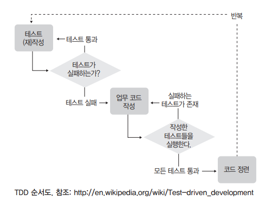

# TDD(Test-Driven Development)

> ## TDD CHAPTER 1 테스트 주도 개발(TDD)

1장 체크리스트  
- [TDD의 정의](#1_definition)
- [TDD의 목표](#1_goal)
- [개발에 있어 TDD의 위치](#1_location)
- [TDD의 진행 방식](#1_proceed)
- [TDD의 장점](#1_merit)


### **`TDD 정의`**<a id="1_definition"></a>

```
프로그램을 작성하기 전에 테스트 먼저 하라!
Test the program before you write it
```

메소드나 함수 같은 프로그램 모듈을 작성할 때 '작성 종료조건을 먼저 정해놓고 코딩을 시작한다'는 의미,  
예를들면 두 숫자의 합을 구해서 반환하는 sum이라는 메소드를 작성한다고 가정

> 예제
```java
public class Calculator {
    public int sum(int a, int b) {
        return 0;
    }

    public static void main(String[] args) {
        Calculator calc = new Calculator();
        System.out.println( calc.sum(10, 20) == 30);
        System.out.println( calc.sum(1, 2) == 3);
        System.out.println( calc.sum(-10, 20) == 10);
        System.out.println( calc.sum(0, 0) == 0);
    }
}
```

> 실행결과
```
false
false
false
true
```

위 예제에서는 main 메소드를 테스트 메소드처럼 사용했다. sum 메소드는 컴파일 에러만 나지 않도록 해놓고, 내부는 비어 있는 상태. sum 메소드를 먼저 구현한 다음에 테스트를 할 수도 있지만, 그렇게 하지 않고 검증코드를 먼저 만들어놓았다. 그검증코드에 해당하는 테스트 케이스를 모두 만족하면, 즉 main 메인 메소드의 실행결과가 모두 true로 나오면 sum 메소드가 정상적으로 작성됐다고 판단하기로 한 것이다. 다시말해 **`명시적인 코드로 개발 종료조건을 정해 놓은 것`** 이다. 이런식의 개발 접근 방식이 바로 TDD이다.  
**`테스트 케이스 작성으로 구현을 시작하는 것, 그게바로 TDD이다.`**

<br/>
<br/>

### TDD의 목표<a id="1_goal"></a>

```
잘 동작하는 깔끔한 코드
Clean code that works
```

TDD라는 방식을 통해 얻고자 하는 최종 목적은 **`'잘 동학하는 깔끔한 코드'`** 이다.  
TDD에선 잘 동작하는 코드만을 개발의 목표로 삼지 않고, 작성된 코드도 명확한 의미를 전달할 수 있게 작성돼야 한다고 말한다. 즉, '제대로 동작함(works)'뿐 아니라 '깔끔함(clean)'까지도 동등한 수준의 개발 목표로 삼는다는 점이 일반적인 개발 방식과 다르다.  
이 차이점은 소프트웨어 품질을 비롯한 `유지보수의 편의성, 가독성 그리고 그에따른 소프트웨어의 비용과 안정성` 등 여러 가지 측면의 의미를 내포한다.

<br/>
<br/>

### 개발에 있어 TDD의 위치<a id="1_location"></a>
```
개발자가 처음으로 수행하는 테스트
```

TDD에서 말하는 단위테스트는 일반적으로 메소드 단위의 테스트를 뜻하고, 전통적인 테스트 방법론에서 이야기하는 단위 테스트는 사용자 측면에서의 제품의 기능을 테스트하는 쪽에 가깝다.

<br/>
<br/>

### TDD의 진행 방식<a id="1_proceed"></a>
> **질문(Ask)** : 테스트 작성을 통해 시스템에 질문한다. (테스트 수행 결과는 실패)  
**응답(Respond)** : 테스트를 통과하는 코드를 작성해서 질문에 대답한다. (테스트 성공)  
**정제(Refine)** : 아이디어를 통합하고, 불필요한 것은 제거하고, 모호한 것은 명확히 해서 대답을 정제한다. (Refactoring)  
**반족(Repeat)** : 다음 질문을 통해 대화를 계속 진행한다.

TDD를 이용한 개발은 크게 **'질문 -> 응답 -> 정제'** 라는 세 단계가 반복적으로 이루어진다.



TDD는 위와 같은 형태의 반복적인 흐름을 갖는다. 단위 테스트 프레임워크(Unit Test Framework)를 사용한 테스트 코드 작성이 이뤄진다고 생각하면 된다.

### `실습예제 - 은행계좌(Account) 클래스 만들기`
- 은행계좌 클래스
    - 계좌 잔고 조회
    - 입금/출금
    - 예상 복리 이자(추가 개발)

[TEST SOURCE 보기](https://github.com/dongkii/spring-boot-webservice/blob/master/src/test/java/Bank_BusinessTest/AccountTest.java)

<br/>
<br/>

### TDD의 장점<a id="1_merit"></a>

- 개발의 방향을 잃지 않게 유지해준다.
- 품질 높은 소프트웨어 모듈 보유
- 자동화된 단위 테스트 케이스를 갖게 된다.
- 사용설명서 & 의사소통의 수단
- 설계 개선
- 보다 자주 성공한다.


<br/>
<br/>
<br/>
<br/>
<br/>
<br/>
<br/>
<br/>

> ### 용어 정리
**- 회귀 테스트(regression test)** : 이미 개발과 테스트가 완료된 모듈에 수정을 가하게 될 경우, 기존에 동작하던 다른 부분도 정상적으로 동작하는지 확인하기 위해 수행하는 테스트. 원칙적으로 기존 모듈에 수정이 가해질 때마다, 해당 모듈 뿐만 아니라 그 모듈과 연관되어 있는 다른 모듈도 변함없이 목표대로 동작하는지를 매번 테스트해야 한다.  

**- 기능 테스트(functional test)** : 개발자 입장보다는 사용자 입장에 좀 더 가까운 형태로 진행되는 기능들의 테스트. 일반적으로 여러 개의 단위 모듈이 합쳐져서 한 개의 기능을 이루는 경우가 많다. 예를 들어 주민번호 입력란에 사용자가 기입할 때, 기능 테스트 입장에선 숫자만 들어가도록 강제화되어 있는지를 테스트한다. 하지만 그 기능을 위해 여러 개의 단위 모듈이 동작할 수도 있기 때문에 TDD에서의 단위 테스트는 그 기능 테스트 하위의 단위 단위들의 모듈을 테스트한다고 보면 되겠다.
